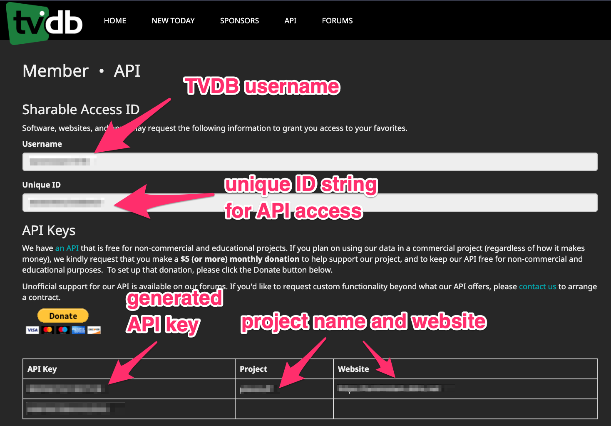
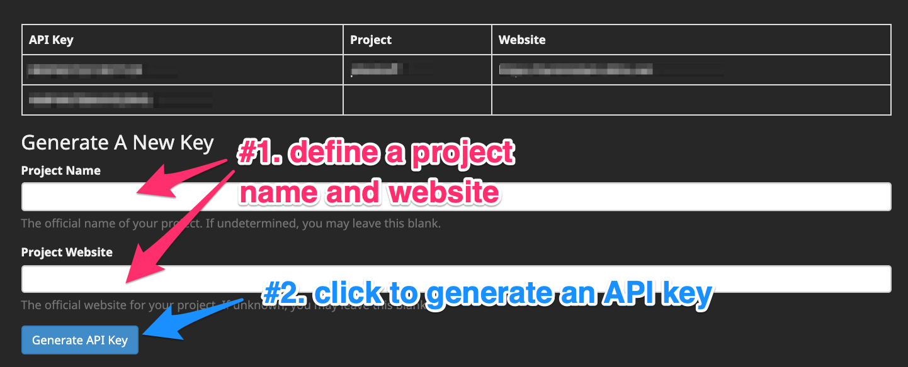
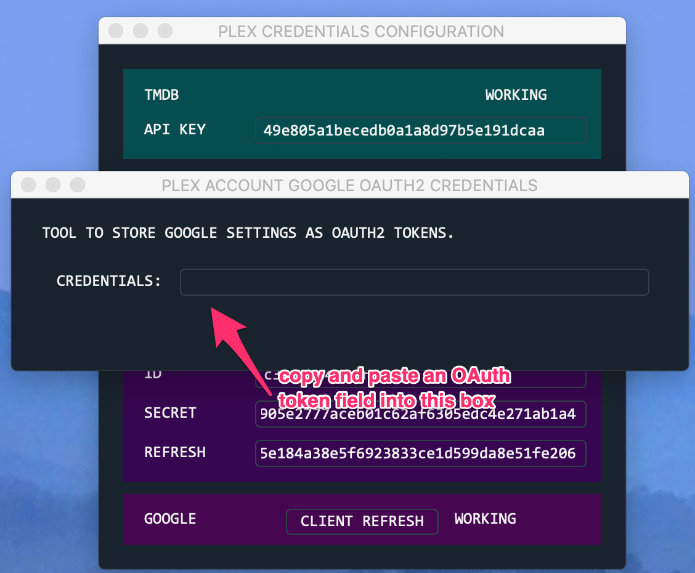
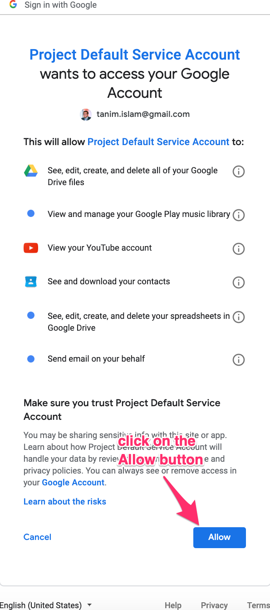

.. toctree::
   :maxdepth: 2
   :caption: Contents:

.. sectnum::
  :maxdepth: 3

.. _plex_services_config:

Plexstuff Services Configuration
--------------------------------
This document contains all the needed information to get started on getting set up with all the **services** you need to get up and running with Plexstuff. Here are the following **services** needed to get all the functionality here.

* Identifying movies using `the Movie Database <https://www.themoviedb.org/>`_.
* Identifying television shows and episodes using `the Television Database <https://www.thetvdb.com/>`_.
* Uploading images for emails using the `Imgur image service <https://imgur.com/>`_.
* Populating music metadata using either the `Gracenote API <https://developer.gracenote.com/web-api>`_ or the `LastFM API <https://www.last.fm/api/>`_.
* Using the `Jackett proxy server <https://github.com/Jackett/Jackett>`_ to consolidate torrent searches among 20-30 public torrent trackers (such as `Torrentz2 <https://torrentz2.eu/>`_, `RARBG <http://rarbg.to/index70.php>`_, `Kickass Torrents <https://en.wikipedia.org/wiki/KickassTorrents>`_, and `The Pirate Bay <https://thepiratebay.org/>`_) through a single search API and service without `CAPTCHAs <https://en.wikipedia.org/wiki/CAPTCHA>`_ and other usability restrictions.
* A bevy of Google services to do the following.
  1. Sending out emails to your Plex users, using the `GMail API <https://developers.google.com/gmail/api/>`_, and identifying them from your Google address book using the `Google Contacts API <https://developers.google.com/contacts/v3/>`_.
  2. Identifying songs on `YouTube <https://www.youtube.com>`_ using the `YouTube API <https://developers.google.com/youtube/v3/>`_.
  3. Access to Google spreadsheets using the `Google Sheets API <https://developers.google.com/sheets/api/>`_.
  4. Upload your music to your `Google Play Music <https://play.google.com/store/music?hl=en>`_ account using the `unofficial Google Music API <https://unofficial-google-music-api.readthedocs.io/en/latest/>`_.

The document is organized into the following sections.

* `The Movie Database (TMDB) API <moviedb_>`_.
* `The Television Database (TVDB) API <tvdb>`_.
* `The Imgur API <imgur_>`_.
* `The Gracenote and LastFM APIs <gracenote_and_lastfm_>`_.
* `The Jackett Server <jackett_server_>`_.
* `Summary of Setting Up Google Credentials <google_services_>`_.

.. _moviedb:: ff
The Movie Database (TMDB) API
^^^^^^^^^^^^^^^^^^^^^^^^^^^^^^^^^^

Follow instructions on getting an access key for the TMDB API `here <https://developers.themoviedb.org/3/getting-started/introduction>`_. Click on the `API link <https://www.themoviedb.org/settings/api>`_.

.. _tvdb::
The Television Database (TVDB) API
^^^^^^^^^^^^^^^^^^^^^^^^^^^^^^^^^^^^^^^^^^^^^
The TVDB API registration is more involved and (currently, as of 2 July 2019) not clearly documented. Here is how I got this to work.

1. Log in or register (if you don't have an account) onto the television database `login page <https://www.thetvdb.com/login>`_. Here is a screen shot.

.. image:: plex-config-services-figures/tmdb_step01_login.png
  :width: 100%
  :align: center

2. Select the **API ACCESS** sub menu option in the right most menu option, which is your TVDB username, **<USERNAME> → API ACCESS**. Here is a screen shot.

.. image:: plex-config-services-figures/tmdb_step02_apiselect.png
  :width: 100%
  :align: center

3. This will send you to the API keys web page for your account. On the top, you will see two labels showing your **username**, and an **unique ID** that the TVDB asigns to you. In the middle section is a table showing the API keys you have created, if any. Each row is a project you have created that the TVDB uses to grant you API access. Each project has an *API key*, the *project name*, and *project website*. A hopefully illuminating screen shot is shown below.

4. Generate an API key by defining a *project name*, *project website*, and then click on the *Generate API key* button. Here is a screen shot.

Make sure to record the TVDB *project name*, *API key*, and *unique ID*.

The final information one programmatically sends to the TVDB service, through REST commands, is represented as the following JSON data.

.. code-block:: JSON

  {
    "apikey":  "XXXXXXX",
    "username": "YYYYYY",
    "userkey":  "ZZZZZZ"
   }

.. _imgur::
The Imgur API
^^^^^^^^^^^^^^^^^^^^^^^^^^^^^^^^^^^^

Good information on setting up Imgur API access can be found on `this website <https://apidocs.imgur.com/?version=latest>`_.

.. _gracenote_and_lastfm::
The Gracenote and LastFM APIs
^^^^^^^^^^^^^^^^^^^^^^^^^^^^^

Instructions for the Gracenote API registration can be found `here <https://developer.gracenote.com/web-api>`_. The implementation of metadata population using Gracenote uses the `pygn <https://github.com/cweichen/pygn>`_ Python module.

The instructions for the LastFM API registration start `here <lastfm_intro_>`_. Here are the steps to get an API key and register your service to use the LastFM API to get music metadata.

1. On the `API intro page <lastfm_intro_>`_, click on the  the *Add API account* link. Here is a screen shot.

.. image:: plex-config-services-figures/lastfm_step01_addapiaccount.png
  :width: 100%
  :align: center

2. You will land on the `LastFM API creation page <lastfm_create_>`_. Fill in the forms for *Application name*, *Application description*, and *Application homepage*. Leave *Callback URL* empty because it is optional. Click on the *Submit* button once done. Here is a screen shot.

.. image:: plex-config-services-figures/lastfm_step02_registerapp.png
  :width: 100%
  :align: center

If everything has worked out, after clicking *Submit* you will see the *Application name*, *API key*, *Shared secret*, and *Registered to* fields. Record this information. Here is a screen shot.

.. image:: plex-config-services-figures/lastfm_step03_success.png
  :width: 100%
  :align: center

.. _lastfm_intro:  https://www.last.fm/api/intro
.. _lastfm_create: https://www.last.fm/api/account/create

.. _jackett_server::
The Jackett Server
^^^^^^^^^^^^^^^^^^^^^^^^^^^^^^^^^^^^^^^^^^^^^^^^^^^^^^^^^^

`Jackett <https://github.com/Jackett/Jackett>`_ is a relatively successful proxy server that consolidates the torrent search large number of public, private, and semi-private torrent trackers and services into a single search user interface and API. It is used as the torrent searching back end for higher level media automated downloaders/maintainers such as `Sonarr <https://sonarr.tv/>`_, `Sickrage <https://www.sickrage.ca/>`_, `Radarr <https://radarr.video/>`_, `Lidarr <https://lidarr.audio/>`_, `Couchpotato <https://couchpota.to/>`_, and yet many others that I have not included.

Plexstuff needs the main URL prefix of the Jackett server, and the Jackett API key, in order to use Jackett programmatically to search for movie and television torrents. The URL prefix is the part of the Jackett Web UI page before the ``UI/dashboard`` in the address. The API key is clearly shown and can be copied.

.. image:: plex-config-services-figures/jackett_step01_webui.png
  :width: 100%
  :align: center
  :alt: Jackett WebUI

.. _google_services::
Summary of Setting Up Google Credentials
^^^^^^^^^^^^^^^^^^^^^^^^^^^^^^^^^^^^^^^^^^^^^^^^^^^^^^^^^^
We set up `Google <https://www.google.com>`_ services that use `YouTube <https://www.youtube.com>`_, GMail, Google Contacts, Google Spreadsheets, and the `unofficial Google Music API <https://unofficial-google-music-api.readthedocs.io/en/latest/>`_.

Since these are all Google services, a single tool sets all of them up given a single Google account using Google's OAuth2_ authentication mechanism. The easiest way to do this is through the ``plex_config_gui.py`` executable, which is part of Plexstuff.

1. Launch ``plex_config_gui.py``, which starts with a three row table: *LOGIN*, *CREDENTIALS*, and *MUSIC*. Right click on the *CREDENTIALS* row to launch a context menu with a single item, *Plex config credentials*. Click on *Plex config credentials*. Here is a screen shot.

.. image:: plex-config-services-figures/google_step01_credentials.png
  :width: 100%
  :align: center

2. A *PLEX CREDENTIALS CONFIGURATION* widget will open. Click on the *CLIENT REFRESH* button in the Google section of this widget. Here is a screen shot.

.. image:: plex-config-services-figures/google_step02_refreshcredentials.png
  :width: 100%
  :align: center

3. A browser window in your default internet browser will launch, asking you to authorize access to a Google account. Here is the first screen shot.

.. image:: plex-config-services-figures/google_step03_authorizeaccount.png
  :width: 100%
  :align: center

4. Also, a new dialog widget will open asking you to put in an OAuth2_ token string once you have given permission. Here is the second screen shot.

5. In step 3, when you choose a Google account, currently you will be redirected to a scary browser page that says "this app isn't verified". It isn't, but the services still work. If you use Google Chrome or derived browser, click on the *Show Advanced* toggling link. Then click on *Go to Project Default Service Account (unsafe)* to go forward. Here is a screen shot.

.. image:: plex-config-services-figures/google_step05_scaryscreen.png
  :width: 100%
  :align: center

6. Plexstuff asks for six different Google authorizations. Click on the *Allow* button.

7. The final browser window shows a text box with the OAuth2_ token string. Copy that string into the GUI dialog widget in step 4, and press return on the text box in that widget.

.. image:: plex-config-services-figures/google_step07_oauthtokencopy.png
  :width: 100%
  :align: center

If all goes well, then all the Google services needed by Plexstuff will have been authorized.

.. _OAuth2: https://en.wikipedia.org/wiki/OAuth#OAuth_2.0
