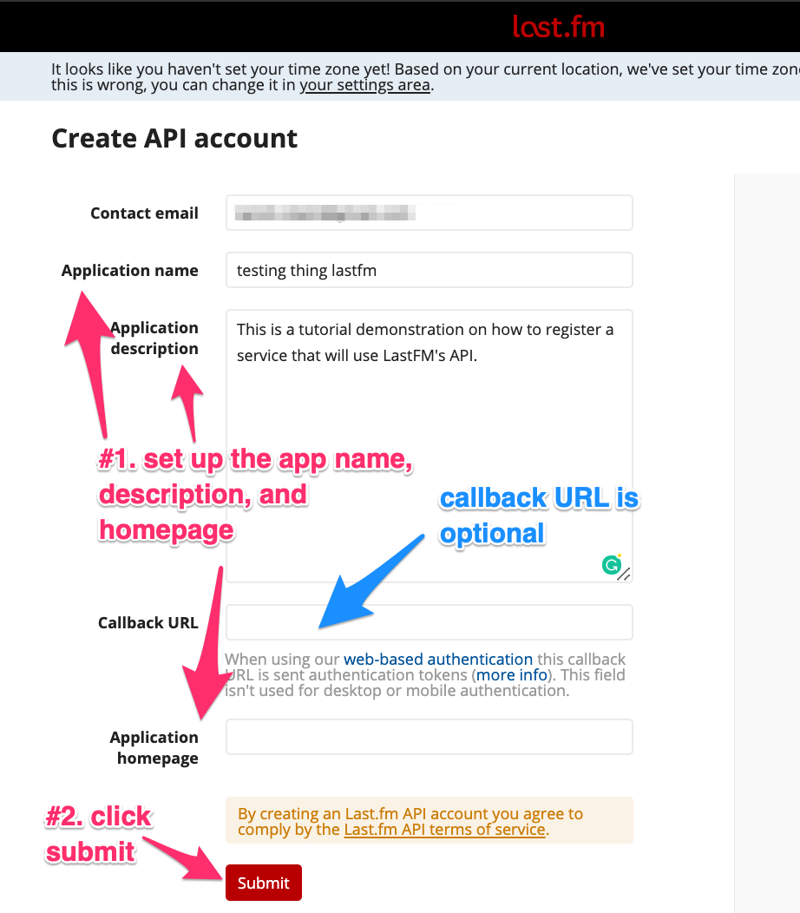

.. toctree::
   :maxdepth: 2
   :caption: Contents:

================================================
Plexstuff Services Configuration
================================================

This document contains all the needed information to get started on getting set up with all the **services** you need to get up and running with Plexstuff. Here are the following **services** needed to get all the functionality here.

* Identifying movies using `the Movie Database <https://www.themoviedb.org/>`_.
* Identifying television shows and episodes using `the Televion Database <https://www.thetvdb.com/>`_.
* Uploading images for emails using the `Imgur image service <https://imgur.com/>`_.
* Populating music metadata using either the `Gracenote API <https://developer.gracenote.com/web-api>`_ or the `LastFM API <https://www.last.fm/api/>`_.
* A bevy of Google services to do the following.
  1. Sending out emails to your Plex users, using the `GMail API <https://developers.google.com/gmail/api/>`_, and identifying them from your Google address book using the `Google Contacts API <https://developers.google.com/contacts/v3/>`_.
  2. Identifying songs on `YouTube <https://www.youtube.com>`_ using the `YouTube API <https://developers.google.com/youtube/v3/>`_.
  3. Access to Google spreadsheets using the `Google Sheets API <https://developers.google.com/sheets/api/>`_.
  4. Upload your music to your `Google Play Music <https://play.google.com/store/music?hl=en>`_ account using the `unofficial Google Music API <https://unofficial-google-music-api.readthedocs.io/en/latest/>`_.

The document is organized into the following sections.

* `The Movie Database (TMDB) API <moviedb_>`_.
* The Television Database (TVDB) API <tvdb>`_.
* `The Imgur API <imgur_>`_.
* `The Gracenote and LastFM APIs <gracenote_and_lastfm_>`_.

.. _moviedb::
The Movie Database (TMDB) API
^^^^^^^^^^^^^^^^^^^^^^^^^^^^^^^^^^^^^^^^

Follow instructions on getting an access key for the TMDB API `here <https://developers.themoviedb.org/3/getting-started/introduction>`_. Click on the `API link <https://www.themoviedb.org/settings/api>`_.

.. _tvdb::
The Television Database (TVDB) API
^^^^^^^^^^^^^^^^^^^^^^^^^^^^^^^^^^^^^^^^^^^^^
The TVDB API registration is more involved and (currently, as of 2 July 2019) not clearly documented. Here is how I got this to work.

1. Log in or register (if you don't have an account) onto the television database `login page <https://www.thetvdb.com/login>`_. Here is a screen shot.

.. image:: plex-config-figures/tmdb_step01_login.png
  :width: 600
  :align: center

2. Select the **API ACCESS** sub menu option in the right most menu option, which is your TVDB username, **<USERNAME> → API ACCESS**. Here is a screen shot.

.. image:: plex-config-figures/tmdb_step02_apiselect.png
  :width: 600
  :align: center

3. This will send you to the API keys web page for your account. On the top, you will see two labels showing your **username**, and an **unique ID** that the TVDB asigns to you. In the middle section is a table showing the API keys you have created, if any. Each row is a project you have created that the TVDB uses to grant you API access. Each project has an *API key*, the *project name*, and *project website*. A hopefully illuminating screen shot is shown below.

.. image:: plex-config-figures/tmdb_step03_apikeys_generated.png
  :width: 600
  :align: center

4. Generate an API key by defining a *project name*, *project website*, and then click on the *Generate API key* button. Here is a screen shot.

.. image:: plex-config-figures/tmdb_step04_apikeys_generate.png
  :width: 600
  :align: center

The final information one programmatically sends to the TVDB service, through REST commands, is represented as the following JSON data.

.. code-block:: JSON

  {
    "apikey":  "XXXXXXX",
    "username": "YYYYYY",
    "userkey":  "ZZZZZZ"
   }

.. _imgur:
The `Imgur <https://imgur.com>`_ API
^^^^^^^^^^^^^^^^^^^^^^^^^^^^^^^^^^^^^^^^^^^^^^^
Good information on setting up Imgur API access can be found on `this website <https://apidocs.imgur.com/?version=latest>`_.

.. _gracenote_and_lastfm:
The `Gracenote <https://developer.gracenote.com/web-api>`_ and `LastFM <https://www.last.fm/api/>`_ APIs
^^^^^^^^^^^^^^^^^^^^^^^^^^^^^^^^^^^^^^^^^^^^^^^^^^^^^^^^^^^^^^^^^^^^^^^^^^^^^^^^^^^^^^^^^^^^^^^^^^^^^^^^^^^^^^^^^^^^^^^^^^^^^^^^^^^^^^^^^^^^^
Instructions for the Gracenote API registration can be found `here <https://developer.gracenote.com/web-api>`_. The implementation of metadata population using Gracenote uses the `pygn <https://github.com/cweichen/pygn>`_ Python module.

The instructions for the LastFM API registration start `here <lastfm_intro_>`_. Here are the steps to get an API key and register your service to use the LastFM API to get music metadata.

1. On the `API intro page <lastfm_intro_>`_, click on the  the *Add API account* link. Here is a screen shot.

.. image:: plex-config-figures/lastfm_step01_addapiaccount.png
  :width: 600
  :align: center

2. You will land on the `LastFM API creation page <lastfm_create_>`_. Fill in the forms for *Application name*, *Application description*, and *Application homepage*. Leave *Callback URL* empty because it is optional. Click on the *Submit* button once done. Here is a screen shot.

.. _lastfm_intro:  https://www.last.fm/api/intro
.. _lastfm_create: https://www.last.fm/api/account/create
