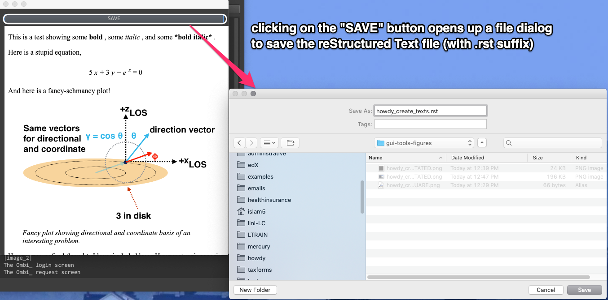

================================================
Howdy Core GUIs
================================================
These are the Howdy_ core GUIs.

* ``howdy_config_gui``, the configuration tool used to get the full Howdy functionality. Its usage is described in :numref:`howdy_config_gui_label`.

* :ref:`howdy_core_gui_label` is a more archaic version of Howdy settings configuration. This only provides a GUI to set up the correct Plex server settings or to set up `Google OAuth2 authentication`_.

* :ref:`howdy_create_texts_label` tests the creation of prettified HTML using reStructuredText_.

.. _howdy_core_gui_label:

|howdy_core_gui_icon|\  |howdy_core_gui|
^^^^^^^^^^^^^^^^^^^^^^^^^^^^^^^^^^^^^^^^

.. _howdy_create_texts_label:

|howdy_create_texts_icon|\  |howdy_create_texts|
^^^^^^^^^^^^^^^^^^^^^^^^^^^^^^^^^^^^^^^^^^^^^^^^^^
This is a simple GUI that demonstrates the creation of prettified HTML using reStructuredText_. Optionally, one can also *save* the output of the created and rendered HTML. Here is the annotated main window that pops up when running ``howdy_create_texts``,

.. _howdy_create_texts_ANNOTATED:

.. figure:: gui-tools-figures/howdy_create_texts_ANNOTATED.png
   :width: 100%
   :align: left

   |howdy_create_texts| has a very simple user interface. Just type in your reStructuredText_ into here and render it by clicking on the ``CONVERT`` button.

Put in some valid reStructuredText_ into that text area, and then click on ``CONVERT`` to render the HTML. One can find some good tutorials on how to write valid reStructuredText_ online or on the Sphinx_ website.

Here is what happens when we render some *fairly complicated* reStructuredText_.

.. _howdy_create_texts_convert_ANNOTATED:

.. figure:: gui-tools-figures/howdy_create_texts_convert_ANNOTATED.png
   :width: 100%
   :align: left

   Clicking on ``CONVERT`` creates a window showing the accurately rendered rich HTML output of the valid reStructuredText_ in a new window.

Finally, clicking on the ``SAVE`` button opens up a file dialog where you can save the input reStructuredText_ into an ``.rst`` file.

.. _howdy_create_texts_save_ANNOTATED:

I have included this :download:`example restructuredText file </_static/howdy_create_texts.rst>` that allows one to independently verify how this reStructuredText_ renders.
   
.. |howdy_create_texts| replace:: ``howdy_create_texts``

.. |howdy_create_texts_icon| image:: gui-tools-figures/howdy_create_texts_SQUARE.png
   :width: 50
   :align: middle

.. |howdy_core_gui| replace:: ``howdy_core_gui``

.. |howdy_core_gui_icon| image:: gui-tools-figures/howdy_core_gui_SQUARE.png
   :width: 50
   :align: middle

.. 
	   
.. _Howdy: https://howdy.readthedocs.io
.. _reStructuredText: https://en.wikipedia.org/wiki/ReStructuredText
.. _`Google OAuth2 authentication`: https://developers.google.com/identity/protocols/oauth2
.. _Sphinx: https://www.sphinx-doc.org/en/master
