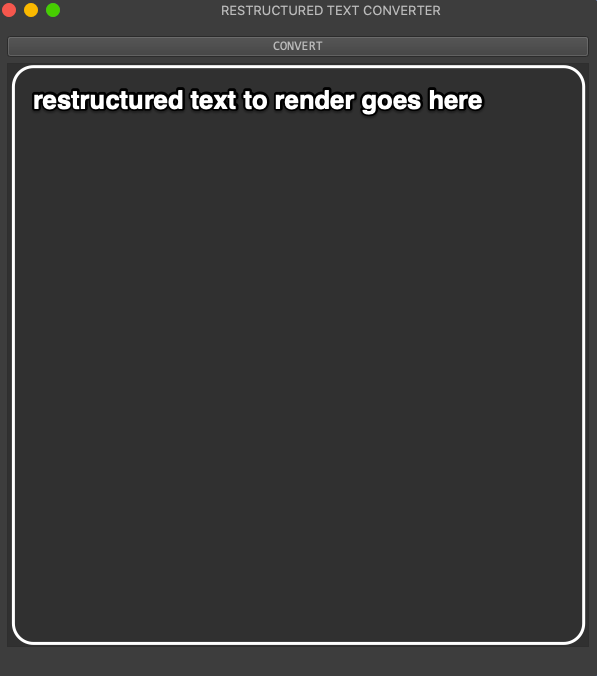
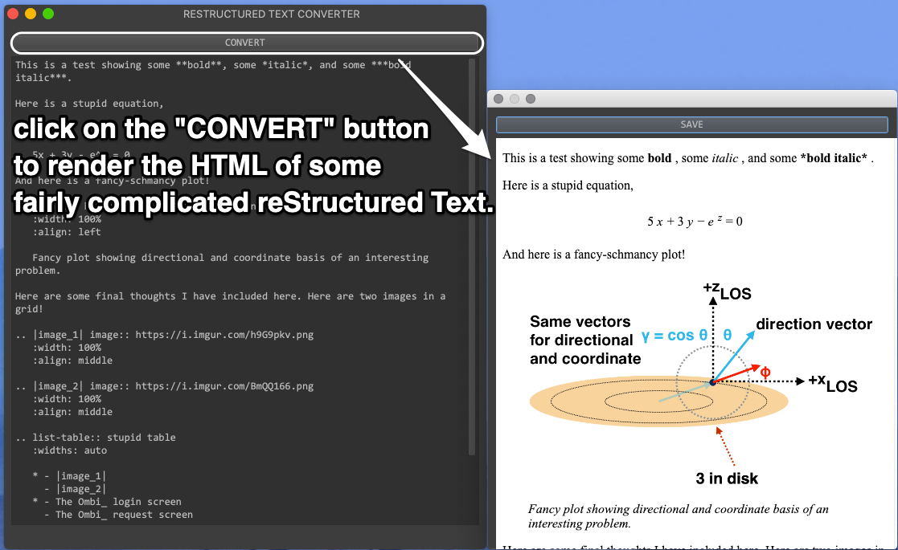

.. _howdy_email_demo_gui_label:

|howdy_email_demo_gui_icon|\  |howdy_email_demo_gui|
^^^^^^^^^^^^^^^^^^^^^^^^^^^^^^^^^^^^^^^^^^^^^^^^^^^^^^
This is a test-bed platform for creating and sending HTML emails using reStructuredText_. Here is the annotated main window that pops up when running |howdy_email_demo_gui|,

.. _howdy_create_texts_ANNOTATED:

   |howdy_email_demo_gui| has a very simple user interface. Just type in your reStructuredText_ into here and render it by clicking on the ``CONVERT`` button.

Put in some valid reStructuredText_ into that text area, and then click on ``CONVERT`` to render the HTML. One can find some good tutorials on how to write valid reStructuredText_ online or on the Sphinx_ website.

Here is what happens when we render some *fairly complicated* reStructuredText_.

.. _howdy_create_texts_convert_ANNOTATED:

   Clicking on ``CONVERT`` creates a window showing the accurately rendered rich HTML output of the valid reStructuredText_ in a new window.

Finally, clicking on the ``SAVE`` button opens up a file dialog where you can save the input reStructuredText_ into an ``.rst`` file.

.. _howdy_create_texts_save_ANNOTATED:

.. figure:: howdy-email-gui-figures/howdy_create_texts_save_ANNOTATED.png
   :width: 100%
   :align: left

   Click on ``SAVE`` to save the reStructuredText_ into an ``.rst`` file.

I have included this :download:`example restructuredText file </_static/howdy_create_texts.rst>` that allows one to independently verify how this reStructuredText_ renders. This is the example file shown in :numref:`howdy_create_texts_convert_ANNOTATED` and :numref:`howdy_create_texts_save_ANNOTATED`.

.. warning::

   This documentation and demonstration's change is a work in progress. I have the *older* documentation for ``howdy_create_texts`` that has existed before the creation of this new branch, :commit:`8cbdfee8e94f974292115070db56e3678dbaaa27`.
   
.. |howdy_email_demo_gui| replace:: ``howdy_email_demo_gui``

.. |howdy_email_demo_gui_icon| image:: howdy-email-gui-figures/howdy_email_demo_gui_SQUARE_VECTA.svg
   :width: 50
   :align: middle

.. _Howdy: https://howdy.readthedocs.io
.. _reStructuredText: https://en.wikipedia.org/wiki/ReStructuredText
.. _`Google OAuth2 authentication`: https://developers.google.com/identity/protocols/oauth2
.. _Sphinx: https://www.sphinx-doc.org/en/master
.. _Plex: https://plex.tv
