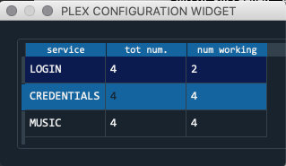
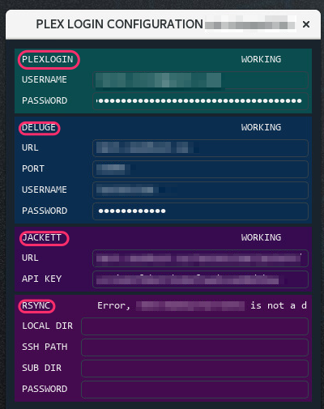
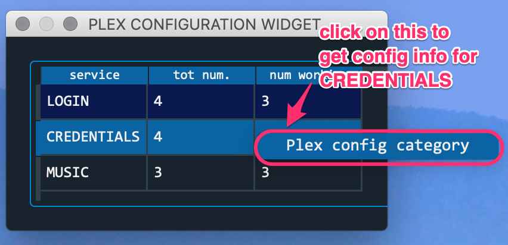
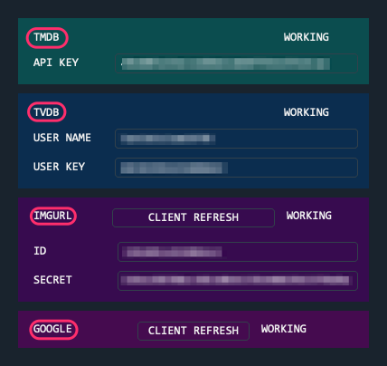
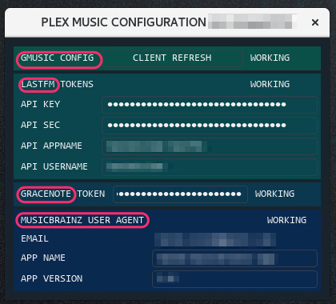

.. _plex_config_gui.py_label:

=================================================================
Consolidating Plexstuff Configuration With ``plex_config_gui.py``
=================================================================

Although ``plex_config_gui.py`` is part of ``plexcore``, and naturally lives in :numref:`Plex Core Functionality`, I suggest you use this configuration tool to naturally consolidate the Plexstuff services and settings. The final configuration data will live in an `sqlite version 3 <https://en.wikipedia.org/wiki/SQLite>`_ database that is located in ``~/.local/plexstuff/app.db`` and is readable only by the user (and root).

Some of the ``plex_config_gui.py`` screenshots are found in :numref:`Summary of Setting Up Google Credentials` (specifically :numref:`imgur_step04_credentials`, :numref:`google_step02_refreshcredentials`, and :numref:`google_step04_oauthtokenstring`) and in :numref:`Plexstuff Settings Configuration` (specifically :numref:`login_step01_login` and :numref:`login_step02_settings`).

As described in :numref:`Plexstuff Services Configuration` and :numref:`Plexstuff Settings Configuration`, ``plex_config_gui.py`` start with the initial dialog widget of three sets of services and settings organized into three rows: *LOGIN*, *CREDENTIALS*, and *MUSIC*. The second column shows the number of services for each service set. The third column shows that number of services that are *working*. A screen shot illuminates this.

.. _plex_config_gui_serviceswidget:

The document is organized into these three sections.

* :ref:`Login Services` describes the dialog window that sets the login services.
* :ref:`Credentials Services` describes the dialog window that sets the credentials. :numref:`Choosing Main Imgur_ Album` describes how to select one's main Imgur_ album used for the storage and retrieval of images when writing newsletter emails (see :numref:`plex_email_gui.py`).
* :ref:`Music Services` describes the dialog window that applies the settings for music services.

Login Services
--------------

As described in :numref:`Plexstuff Settings Configuration`, right click on the *LOGIN* row in the main widget to launch the *PLEX LOGIN CONFIGURATION* widget. The relevant screen shot, :ref:`login window <login_step01_login>`, is shown below.

.. figure:: plex-config-settings-figures/login_step01_login.png
  :width: 100%
  :align: center

The *PLEX LOGIN CONFIGURATION* widget is organized into four services, each organized into differently colored sub-widgets. The top row of each widget gives the name of the service, and its status (working or not working). The login widget controls settings for four services:

* *PLEXLOGIN*: the username and password for your Plex_ account.
* *DELUGE*: necessary settings to access your `Deluge torrent server <Deluge_>`_.
* *JACKETT*: the URL and API key for your `Jackett torrent searching server <Jackett_>`_.
* *RSYNC*: settings used to securely copy downloaded movies and TV shows from a remote server to the Plex_ server you control.

Here is a screen shot.

Use your Plex_ email and password for *PLEXLOGIN*, as described in :numref:`Credentials for Plex Account`. Set up at least your Deluge server according to :numref:`Seedhost Services Setup`. Set up *JACKETT* as described in :numref:`The Jackett Server`, and more conveniently using a Jackett server provided by Seedhost (see :numref:`Seedhost Services Setup` for more details). Finally, apply *RSYNC* settings according to :numref:`Local and Remote (Seedhost) SSH Setup`.

Credentials Services
----------------------------

As described in :numref:`Summary of Setting Up Google Credentials`, right click on the *CREDENTIALS* row in the main widget to launch the *PLEX CREDENTIALS CONFIGURATION* widget. The relevant screen shot, :ref:`credentials window <imgur_step04_credentials>`, is shown below.

The *PLEX CREDENTIALS CONFIGURATION* widget is organized into four services: the `TMDB service <https://www.themoviedb.org>`_, the `TVDB service <https://www.thetvdb.com>`_, the `Imgur image hosting service <https://imgur.com>`_, and Google's services (see :numref:`Plexstuff Services Configuration` for a list). Here is a screen shot.

Apply the TMDB service settings according to :numref:`The Movie Database (TMDB) API`. Apply the TVDB service settings according to :numref:`The Television Database (TVDB) API`. Apply the Imgur settings according to :numref:`The Imgur API`. Finally, follow instructions in :numref:`Summary of Setting Up Google Credentials` to set up all six of the Google and Google-related services that Plexstuff uses.

Choosing Main Imgur_ Album
^^^^^^^^^^^^^^^^^^^^^^^^^^^

Music Services
----------------------------

Right click on the *MUSIC* row in the main widget to launch the *PLEX MUSIC CONFIGURATION WIDGET*. Here is a screen shot.

.. figure:: plex-config-gui-figures/plex_credentials_selectmusic.png
  :width: 100%
  :align: center

The *PLEX MUSIC CONFIGURATION* widget is organized into four services, each organized into differently colored sub-widgets: GMUSIC (the `unofficial Google Music API service <https://unofficial-google-music-api.readthedocs.io/en/latest>`_), the `LastFM music metadata service <https://www.last.fm/api>`_, the `Gracenote music metadata service <https://developer.gracenote.com/web-api>`_, and the `MusicBrainz music metadata service <https://musicbrainz.org/>`_. Here is a screen shot.

:numref:`Summary of Setting Up Google Credentials` describes how to set up *GMUSIC*, since the unofficial Google Play API uses Google's services infrastructure. Copy the relevant information for *LASTFM* and *GRACENOTE* according to :numref:`The Gracenote and LastFM APIs`.

Public access to the MusicBrainz service requires a `valid user agent <https://musicbrainz.org/doc/XML_Web_Service/Rate_Limiting#Provide_meaningful_User-Agent_strings>`_. Plexstuff uses the `musicbrainzngs <https://python-musicbrainzngs.readthedocs.io/en/v0.6>`_ Python module to access the MusicBrainz web service. This module requires an user agent with three elements:

* email address.
* version number.
* app version (as a string).

The email address is taken from the login email for your Plex_ account. You can *probably* put nearly any non-empty string into the *APP VERSION* and *APP NAME* dialog boxes.

.. _Plex: https://plex.tv
.. _Deluge: https://en.wikipedia.org/wiki/Deluge_(software)
.. _Jackett: https://github.com/Jackett/Jackett
.. _Imgur: https://imgur.com
