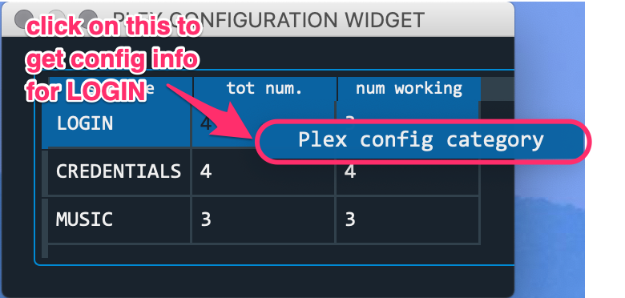

================================================
Plexstuff Settings Configuration
================================================

This document contains all the needed information to get started on getting set up with all the **Plex server settings** one needs to get up and running with Plexstuff. This setup developed here uses the `Seedhost <https://www.seedhost.eu>`_ `seedbox <https://en.wikipedia.org/wiki/Seedbox>`_ service to downloaded files, using the `Deluge torrent server <https://deluge-torrent.org>`_, to download to one's home machine.

This configuration is handled through the ``plex_config_gui.py``, and consists of the following elements. The *Plex Settings Configuration* document describes the Jackett server settings, where one may use either the Jackett server provided by Seedbox or one's own server.

1. Plex user settings.
   
  * user name.
  * password.

2. Deluge and Seedhost settings.

  * the URL of the Deluge server.
  * the port number of the Deluge server.
  * the username of the Deluge server and the SSH account (both are the same).
  * the password of the Deluge server and the SSH account.

3. Local settings to transfer downloaded torrent files to one's local machine.

  * The local directory on one's machine to download finished torrent files from your Seedhost machine.
  * The SSH path (``username@server path``) of the remote machine.
  * The sub directory, below the main directory of the SSH user directory on the Seedhost account, to look for downloaded files.
  * The password on the Seedhost account.

To begin, launch ``plex_config_gui.py``, which starts with a three row table: *LOGIN*, *CREDENTIALS*, and *MUSIC*. Right click on the *CREDENTIALS* row to launch a context menu with a single item, *Plex login credentials*. Click on *Plex login credentials*. Here is a screen shot.

.. _login_step01_login:

The dialog widget that launches shows the Plex and other server settings that are set in order for Plexstuff to fully function. The inset in **blue** refers to the Jackett server settings.

.. _login_step02_settings:

.. figure:: plex-config-settings-figures/login_step02_settings.png
  :width: 100%
  :align: center

I confess that the current organization of this data is duplicated and not fully logical. For example, why define the username and password in two places instead of one? Here are two reasons:

* Lack of time and effort in making the organization of this setup fully logical.

* (Implicit) freedom to choose non Seedhost Deluge and SSH servers.

The document is organized into the following sections. The second section describes the easiest setup, which uses Seedhost's services.

* :ref:`Credentials for Plex Account`.
* :ref:`Seedhost Services Setup`.
* :ref:`Local and Remote (Seedhost) SSH Setup`.

Credentials for Plex Account
----------------------------
This assumes that you already have a `Plex Account <https://plex.tv>`_ with server already set up. If you don't, and want to get started, a good place to start is a blog entry I have written, `How to share your Plex media <https://tanimislamblog.wordpress.com/2017/09/27/how-to-share-your-plex-media/>`_. Just record your username and password.

Seedhost Services Setup
-----------------------

First, if you do not have an account, `register a Seedhost account <https://www.seedhost.eu/whmcs/register.php>`_. The username and password you choose or have will be the username and password for the SSH and Deluge server accounts.

Second, set up a Deluge server.

1. Go log in to the `client area <https://www.seedhost.eu/whmcs/clientarea.php>`_.

2. Click on the *Services* button. Here is a screen shot.

.. image:: plex-config-settings-figures/seedhost_step02_chooseservices.png
  :width: 100%
  :align: center

3. Click on the particular Seedhost service (this is the seedbox host) you have. Here is a screen shot.

.. image:: plex-config-settings-figures/seedhost_step03_clickservice.png
  :width: 100%
  :align: center

4. Click on the *Addons* button to add Seedhost services, such as Jackett or Deluge. Here, use this to start up a Deluge server. Here is a screen shot.

.. image:: plex-config-settings-figures/seedhost_step04_clickaddons.png
  :width: 100%
  :align: center

5. You will click on the *Install* button associated with the Deluge row in this new page, if the Deluge server has not already been installed. Here is a screen shot.

.. image:: plex-config-settings-figures/seedhost_step05_installdeluge.png
  :width: 100%
  :align: center

6. Once the Deluge server has been installed, click on the *Login* button. You will be prompted to the Deluge server WebUI page. Put in your (Seedhost/SSH/Deluge) password. The URL of your Deluge server is ``https://dark.seedhost.eu/<username>/deluge``. Here is a screen shot.

.. image:: plex-config-settings-figures/seedhost_step06_logindeluge.png
  :width: 100%
  :align: center

7. Instructions on getting the port number for the Deluge server comes from this fairly opaque `Seedhost knowledgebase article <https://www.seedhost.eu/whmcs/knowledgebase/89/Deluge-thin-configuration.html>`_. First, click on the *Connection Manager* button on the upper right menu corner of the Deluge WebUI. A *Connection Manager* detached window opens. The part of the address after the colon is the port number. Note that port number. Here is a screen shot.

.. image:: plex-config-settings-figures/seedhost_step07_delugeportnumber.png
  :width: 100%
  :align: center

The Deluge server connection requires three bits of information.

* URL is ``https://dark.seedhost.eu``.
* username and password is from your Seedhost account.
* port is from step #7.

Local and Remote (Seedhost) SSH Setup
---------------------------------------

You have already set up your SSH account by registering a Seedhost account. Presumably you know enough to have a an SSH account on a server you own, and on which your Plex server runs. This is usually your login account on your home SSH server. All instructions refer to the login dialog widget shown in :numref:`login_step02_settings`.

* Put the full username and SSH server URL path into the *SSH Path* text box.

* Put the Seedhost (account/Deluge/SSH) password into the *PASSWORD* text box.

* The remote directory on the Seedhost account, where torrent files are downloaded, is typically ``downloads``. Put that into the *SUB DIR* text box.

* Choose the local directory where the torrent files from the remote Seedhost SSH server download. This is used by the Plexstuff tools ``rsync_subproc.py`` and ``get_plextvdb_batch.py``. Put this local directory into the *LOCAL DIR* text box.
