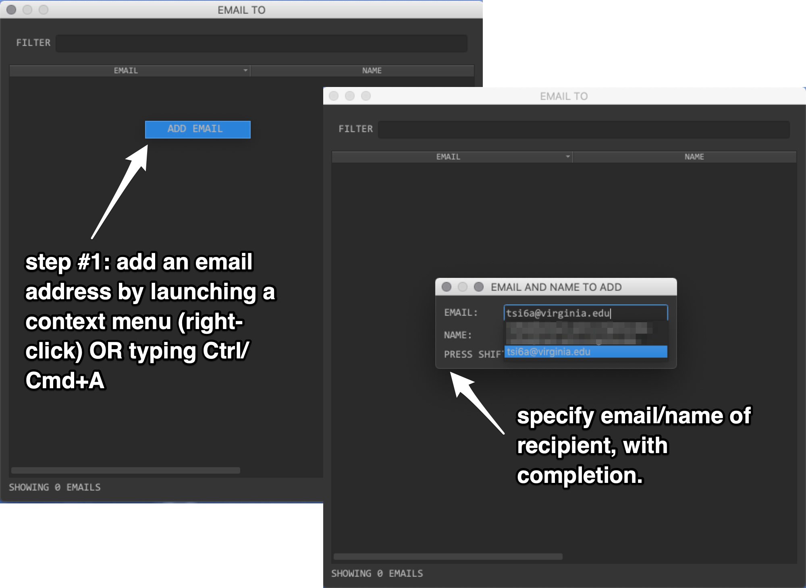
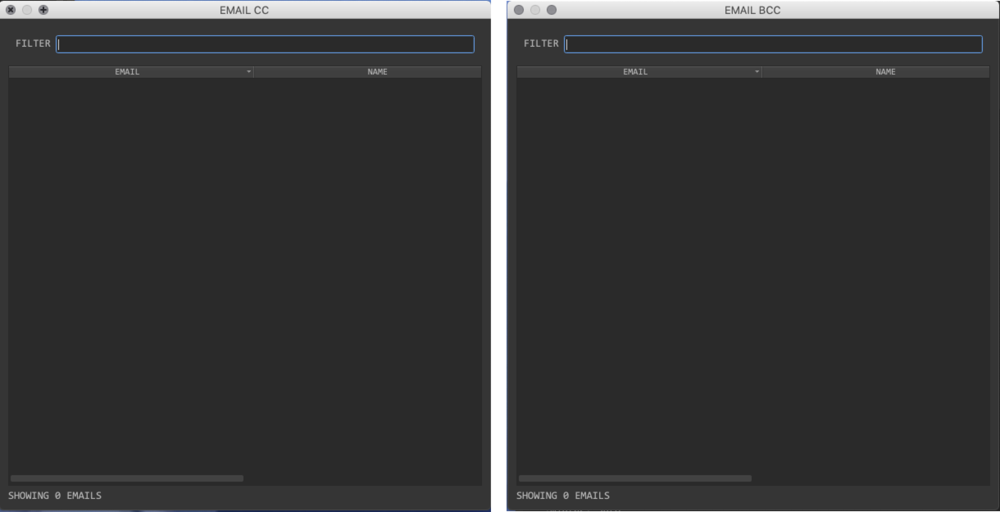
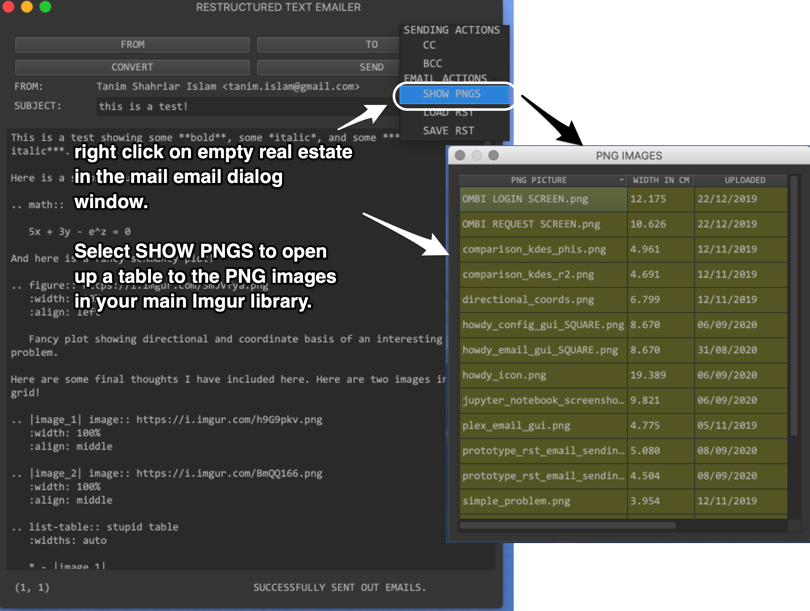

.. _howdy_email_demo_gui_label:

|howdy_email_demo_gui_icon|\  |howdy_email_demo_gui|
^^^^^^^^^^^^^^^^^^^^^^^^^^^^^^^^^^^^^^^^^^^^^^^^^^^^^^
This is a test-bed platform for creating and sending HTML emails using reStructuredText_. Its functionality and behavior intersects significantly with :ref:`howdy_email_gui <howdy_email_gui_label>`. The help output, when running ``howdy_email_demo_gui -h``, produces the following output,

.. code-block:: console

   usage: howdy_email_demo_gui [-h] [--info] [--noverify]

   optional arguments:
     -h, --help  show this help message and exit
     --info      Run info mode if chosen.
     --noverify  Do not verify SSL transactions if chosen.

Here are the command line arguments,

* ``--info`` prints out :py:const:`INFO <logging.INFO>` level :py:mod:`logging` output.

* ``--noverify`` is a standard option in many of the Howdy CLI and GUIs to ignore verification of SSL transactions. It is optional and will default to ``False``.

Here is the main window that pops up when running ``howdy_email_demo_gui --noverify``.

.. _howdy_email_demo_gui_ANNOTATED_label:

.. figure:: howdy-email-gui-figures/howdy_email_demo_gui_ANNOTATED.png
   :width: 100%
   :align: left

   |howdy_email_demo_gui| starts off with the following initial interface. I have denoted the box into which you write your reStructuredText_ to render as HTML, and then email, to your recipients.

The first sections detail the standard work flow of sending an email into five steps, in order.

1. :ref:`specifying a sender <specifying_sender_label>`.

2. :ref:`selecting recipients <selecting_recipients_label>`.

3. :ref:`writing out the subject <writing_out_subject_label>`.

4. :ref:`writing and verifying the email <writing_email_label>`.

5. :ref:`sending email <sending_email_label>`.

However, you can do steps 1-4 in any order before sending the email. In addition, I describe the following optional functionalities.

1. :ref:`specifying CC and BCC <specifying_cc_bcc_recipients_label>`.

2. :ref:`identifying and selecting PNG images <identifying_selecting_images_label>`.

3. :ref:`loading and saving reStructuredText <loading_saving_restructuredtext_label>`.

I send from myself (``Tanim Shahriar Islam``) and send only to myself, but to different email addresses I control, in this demonstration.

.. _specifying_sender_label:
	   
Specifying a sender
--------------------
First, we specify a sender by clicking on the ``FROM`` button.

.. figure:: howdy-email-gui-figures/howdy_email_demo_gui_FROM_ANNOTATED.png
   :width: 100%
   :align: left

   Click on this button to open up a dialog window where one specifies the email address, and optionally the name, of the sender.

Second, once this dialog window opens, specify *at least* the email. Completion functionality exists when setting both the email address and the recipient.

.. _howdy_email_demo_gui_FROM_SENDER_ANNOTATED_label:

.. figure:: howdy-email-gui-figures/howdy_email_demo_gui_FROM_SENDER_ANNOTATED.png
   :width: 100%
   :align: left

   Choose the *email* and the *name* of the sender. Completion exists among email addresses and names found in the Google Contacts in your address book. Here, I choose 

If you choose an email address that is already known, the sender's name is automatically filled out. Even though names can be completed, the email address won't be specified even if you choose a known contact name. This happens because a contact can have multiple email addresses.

Third, once you have chosen a sender email, and optionally a sender name, then you can close this dialog window by clicking the upper left close box, or typing ``Ctrl+W1`` on Windows and Linux or ``Cmd+W`` on Mac OS X.

.. _howdy_email_demo_gui_FROM_FINAL_ANNOTATED_label:

.. figure:: howdy-email-gui-figures/howdy_email_demo_gui_FROM_FINAL_ANNOTATED.png
   :width: 100%
   :align: left

   The ``FROM`` label is filled out once you have specified an email address and optionally a name. If you *also* specify a name, the `RFC 2047`_ formatted email info (looking like "NAME" <EMAIL ADDRESS>) shows up in the ``FROM`` label.

.. _selecting_recipients_label:

Selecting recipients
----------------------
You can then select recipients by clicking on the ``TO`` button. Here we start from :numref:`howdy_email_demo_gui_FROM_FINAL_ANNOTATED_label`. This will open up a dialog window that allows you to *add* and optionally *remove* email addresses.

.. _howdy_email_demo_gui_TO_ANNOTATED_label:

.. figure:: howdy-email-gui-figures/howdy_email_demo_gui_TO_ANNOTATED.png
   :width: 100%
   :align: left

   You can add in the email addresses through this ``TO`` recipients dialog window.

Next, you can add recipients individually. In the dialog window launched in :numref:`howdy_email_demo_gui_TO_ANNOTATED_label`, either launch a context menu (right-click your mouse) or press ``Ctrl/Cmd+A``.

.. _howdy_email_demo_gui_TO_STEP1_ANNOTATED_label:

   You can launch the add email dialog window by pressing right-click and selecting ``ADD EMAIL`` in the context menu, or by typing ``Ctrl/Cmd+A``. Here, the recipient specification has the same completion functionality as shown in :numref:`howdy_email_demo_gui_FROM_SENDER_ANNOTATED_label`.

Finally, once you have specified the first recipient's email and (optionally) name, press ``Shift+Ctrl/Cmd+A`` to add that recipient.

.. _howdy_email_demo_gui_TO_STEP2_ANNOTATED_label:

.. figure:: howdy-email-gui-figures/howdy_email_demo_gui_TO_STEP2_ANNOTATED.png
   :width: 100%
   :align: left

   Press ``Shift+Ctrl/Cmd+A`` to add this recipient to the list of people to whom you will send this email.

Subsequent recipients can be added by going through new contacts as shown in :numref:`howdy_email_demo_gui_TO_STEP1_ANNOTATED_label` and then :numref:`howdy_email_demo_gui_TO_STEP2_ANNOTATED_label`. *However* if you specify a name or the email address matches all or in part to an address that already exists in that recipient table, then that email address won't be added -- this machinery thinks you have already added this recipient, so why add them again?

.. figure:: howdy-email-gui-figures/howdy_email_demo_gui_TO_RECIPIENTS_ANNOTATED.png
   :width: 100%
   :align: left

   Here I have added five recipients. I own these two email addresses, ``tanim_shahriar_islam@yahoo.com`` and ``tanim.islam@gmail.com``, and my Google Contacts identify both as ``Tanim Islam``. In this case, I specified the name as ``Recipient #2`` and ``Recipient #3``. I have blurred out the email addresses and names of two other contacts. One may notice that ``tanim.islam@gmail.com`` is the sender as shown in :numref:`howdy_email_demo_gui_FROM_FINAL_ANNOTATED_label`.

:numref:`howdy_email_demo_gui_TO_REMOVEEMAIL_ANNOTATED_label` shows how to remove a specific email from the list of recipients.

.. _howdy_email_demo_gui_TO_REMOVEEMAIL_ANNOTATED_label:
	
.. figure:: howdy-email-gui-figures/howdy_email_demo_gui_TO_REMOVEEMAIL_ANNOTATED.png
   :width: 100%
   :align: left

   Select (hover over) one of the recipients, and launch a context menu by right-clicking. Select, in this case, ``REMOVE EMAIL`` to remove that recipient. Here, I removed one email from five recipients to get four recipients.

One can also go to an existing recipient in the table, and change their email address or name.

.. _howdy_email_demo_gui_TO_CHANGEEMAIL_ANNOTATED_label:

.. figure:: howdy-email-gui-figures/howdy_email_demo_gui_TO_CHANGEEMAIL_ANNOTATED.png
   :width: 100%
   :align: left

   To change an email address or name of a recipient, select the cell (either name or email), double click on it, and then type in a new email or name. Once satisfied, press return or enter. If the name or email is *valid*, then the single recipient's name or email is modified.

However, just as in :numref:`howdy_email_demo_gui_TO_STEP2_ANNOTATED_label`, if we change the name or email to something that matches whatever is already in the table of recipients, then that contact will not be changed -- like before, this machiinery will not let you add a recipient that is already in the table.

If you have many (say :math:`\ge 20`) recipients, filtering functionality can be useful.

.. _howdy_email_demo_gui_TO_FILTEREMAIL_label:

.. figure:: howdy-email-gui-figures/howdy_email_demo_gui_TO_FILTEREMAIL.png
   :width: 100%
   :align: left

   Example regular expression filtering of recipients. Here, we filter on recipients whose names or email addresses contain ``gmail.com``. This filtering specification can also take `regular expressions <regex_>`_.

You can do a regex_ filtering by specifying a filter string on the ``FILTER`` dialog box at the top of this ``TO`` recipient dialog window.

Once you are done specifying your recipients, you can upper-left click on the close box of this recipient dialog window, or press ``Ctrl/Cmd+W``. This will ``hide`` this recipient dialog window. If you click ``TO`` again, then you will see the recipients you have already specified.

.. _writing_out_subject_label:

Writing out the subject
-------------------------
Next, just write out the subject into the ``SUBJECT`` dialog box. The subject cannot be blank. Once you are satisfied, press ``Enter`` or ``Return`` in this line. The subject will have all white spaces removed.

.. _howdy_email_demo_gui_SUBJECT_ANNOTATED_label:

.. figure:: howdy-email-gui-figures/howdy_email_demo_gui_SUBJECT_ANNOTATED.png
   :width: 100%
   :align: left

   Just type in a subject into the ``SUBJECT`` dialog box, and then press enter. Ensure that the whitespace stripped subject you choose is not empty, otherwise this tool will not send an email.

.. _writing_email_label:

Writing and verifying the email
---------------------------------
Now that you have specified a sender, recipients, and subject, you can write an email. You can write some valid reStructuredText_ into the main text area described in :numref:`howdy_email_demo_gui_ANNOTATED_label`, and then click on ``CONVERT`` to render the HTML. One can find some good tutorials on how to write valid reStructuredText_ online or on the Sphinx_ website. I have included this :download:`example restructuredText file </_static/howdy_create_texts.rst>` that allows one to independently verify how this reStructuredText_ renders. This is the example file shown in :numref:`howdy_email_demo_gui_CONVERT_ANNOTATED_label`.

.. _howdy_email_demo_gui_CONVERT_ANNOTATED_label:

.. figure:: howdy-email-gui-figures/howdy_email_demo_gui_CONVERT_ANNOTATED.png
   :width: 100%
   :align: left

   Clicking on ``CONVERT`` creates a window showing the accurately rendered rich HTML output of the valid reStructuredText_ in a new window. Check the HTML to see if this is the email you want to send.

.. _sending_email_label:

Sending the email
-------------------
*Finally*, once you have sender, recipients, subject, and email, you can *send* the email out. Just click ``SEND``, and the email should go to your ``TO`` recipients. The sender, usually yourself, will also receive a ``BCC`` email, to allow you to record and archive this email if needed.

.. _howdy_email_demo_gui_SEND_ANNOTATED_label:

.. figure:: howdy-email-gui-figures/howdy_email_demo_gui_SEND_ANNOTATED.png
   :width: 100%
   :align: left

   If the sending goes smoothly, after clicking the ``SEND`` button, this will be the status text: ``SUCCESSFULLY SENT OUT EMAILS.`` Each recipient will receive the HTML email rendered as in :numref:`howdy_email_demo_gui_CONVERT_ANNOTATED_label`.

Optional functionalities
-------------------------
In addition to the required operations needed to send emails with a subject and body, from a single sender to multiple ``TO`` recipients, there are five other functionalities that can be used to assist or enhance the emails you choose to send out. These *optional* functionalities are specified in a context menu that is launched from empty real estate in the main email dialog window, as shown in :numref:`howdy_email_demo_gui_ANNOTATED_label`.

.. _specifying_cc_bcc_recipients_label:

Specifying ``CC`` and ``BCC`` recipients
++++++++++++++++++++++++++++++++++++++++++
One can also specify ``CC`` and ``BCC`` recipients. The ``CC`` and ``BCC`` dialog recipients look very similar, and have the same functionality, as the :ref:`TO recipients <selecting_recipients_label>`. The only difference is that the recipients are ``CC``'d and ``BCC``'d, respectively.

To select the ``CC`` or ``BCC`` recipients, right-click to launch a context menu event in the empty real estate inside main email dialog window: *outside* the email text area and *outside* the subject dialog box. Choose the ``CC`` or ``BCC`` context menu item to specify ``CC`` or ``BCC`` recipients, respectively.

.. _howdy_email_demo_gui_CC-BCC_ANNOTATED_label:

.. figure:: howdy-email-gui-figures/howdy_email_demo_gui_CC-BCC_ANNOTATED.png
   :width: 100%
   :align: left

   Right-click on some empty real estate to specify ``CC`` or ``BCC`` recipients from the context menu.

The ``CC`` and ``BCC`` recipient dialog windows look very similar to the :ref:`TO recipients dialog window <howdy_email_demo_gui_TO_ANNOTATED_label>`.

.. _howdy_email_demo_gui_CC-BCC_DIALOGWINDOWS_label:

   For completeness, here are the ``CC`` and ``BCC`` recipients dialog windows. The only difference in their functionality to the :ref:`TO recipients dialog window <howdy_email_demo_gui_TO_ANNOTATED_label>` is that the recipients are ``CC``'d or ``BCC``'d.

.. _identifying_selecting_images_label:

Identifying and selecting PNG_ images
++++++++++++++++++++++++++++++++++++++++++
You can specify the PNG_ images from your main Imgur_ library. To select your PNG_ images,  right-click to launch a context menu event in the empty real estate inside main email dialog window.

.. _howdy_email_demo_gui_SHOWPNGS_ANNOTATED_label:

   Right-click to open a context menu, and choose ``SHOW PNGS`` to launch the dialog window that lets you identify and select those PNG_ images you want to include in your email.

The PNG_ image dialog window operates the same as what is described in :numref:`write_and_test_email_label` for :ref:`howdy_email_gui_label`.

.. _loading_saving_restructuredtext_label:

Loading and saving reStructuredText_
++++++++++++++++++++++++++++++++++++++++++
Often times, the email you want to send is fairly complicated reStructuredText_. It is either hard to remember or reconstruct the document, so you may find it useful to *save* it to a file (keeping you from starting from scratch if you made a mistake), or *load* it from a file (if you had made a mistake in your email).

To *save* the email to a reStructuredText_ file, let us start from the email we have sent out, taken from :download:`example restructuredText file </_static/howdy_create_texts.rst>`. In some empty real estate, right-click to launch the context menu and select ``SAVE RST``. Save the file with some ``.rst`` suffix.

.. _howdy_email_demo_gui_SAVERST_ANNOTATED_label:

.. figure:: howdy-email-gui-figures/howdy_email_demo_gui_SAVERST_ANNOTATED.png
   :width: 100%
   :align: left

   Right-click to open a context menu, and choose ``SAVE RST``. This launches a file dialog where you can save the email text in the main text area as a reStructuredText_ file.

Likewise, to *load* a reStructuredText_ file into the email, right-click on some empty real estate and select ``LOAD RST``.

.. _howdy_email_demo_gui_LOADRST_ANNOTATED_label:

.. figure:: howdy-email-gui-figures/howdy_email_demo_gui_LOADRST_ANNOTATED.png
   :width: 100%
   :align: left

   Here, we load in the demonstration reStructuredText_ file, ``howdy_create_texts.rst``, from ``docs/source/_static/howdy_create_texts.rst``, to reproduce the same email as shown in :numref:`howdy_email_demo_gui_CONVERT_ANNOTATED_label`.

This will fill the email text area with that reStructuredText_ file. You can then click on ``CONVERT`` to verify that this is the email you want to send.

.. _Howdy: https://howdy.readthedocs.io
.. _reStructuredText: https://en.wikipedia.org/wiki/ReStructuredText
.. _`Google OAuth2 authentication`: https://developers.google.com/identity/protocols/oauth2
.. _Sphinx: https://www.sphinx-doc.org/en/master
.. _Plex: https://plex.tv
.. _PNG: https://en.wikipedia.org/wiki/Portable_Network_Graphics
.. _`RFC 2047`: https://tools.ietf.org/html/rfc2047.html
.. _regex: https://en.wikipedia.org/wiki/Regular_expression
.. _Imgur: https://imgur.com

.. |howdy_email_demo_gui| replace:: ``howdy_email_demo_gui``

.. |howdy_email_demo_gui_icon| image:: howdy-email-gui-figures/howdy_email_demo_gui_SQUARE_VECTA.svg
   :width: 50
   :align: middle
