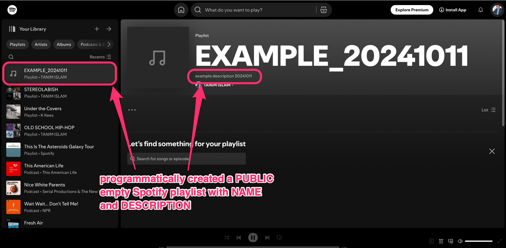

================================================
Howdy Music Command Line Utilities
================================================
This section describes the four Howdy music command line utilities.

* :ref:`howdy_music_album` can do three possible things: download an album image given an artist name and album name; pretty-print out all the studio albums released by an artist; and print out all the songs released on an album by an artist. It uses either the LastFM_ or MusicBrainz_ APIs.

* :ref:`howdy_music_metafill` is an older Plex_ Music executable. It gets choices and song clips from YouTube_ and music metadata using the Gracenote_ API. This was an earlier trial to improve the functionality of :ref:`howdy_music_songs`.

* :ref:`howdy_music_songs` is a work-horse CLI that can do three things (:ref:`download songs with artist and song list <download_by_artist_songs>`, :ref:`download songs with artist and album <download_by_artist_album>`, or :ref:`download a list of songs with a list of corresponding artists <download_by_artists_songs_list>`) using the three music metadata services: Gracenote_ (|gracenote_image|), LastFM_ (|lastfm_image|), or MusicBrainz_ (|musicbrainz_image|).

* :ref:`howdy_music_process_playlists` can do various operations on Plex_ playlists associated with your user account; it can list the Plex_ playlists that exist for your account, *and* it can dump a *specific* Plex_ audio playlist you specify into an HDF5_ :py:class:`Pandas DataFrame <pandas.DataFrame>` file.

* :ref:`howdy_music_spotify_push_from_plex` can do these four things:

  #. Summarize the audio-only Plex_ playlists on your account.

  #. Summarize the public Spotify_ playlists on your Spotify_ account.
     
  #. Create a public Spotify_ playlist on your Spotify_ account.

  #. Push an audio-ony Plex_ playlist into one of your public Spotify_ playlists.
  
* :ref:`upload_to_gmusic` uploads MP3_ or M4A_ music files to one's `Google Play Music`_ account, or pushes the appropriate :py:mod:`gmusicapi` :py:class:`Mobileclient <gmusicapi.Mobileclient>` credentials into the SQLite3_ configuration database.

.. _howdy_music_album_label:

howdy_music_album
^^^^^^^^^^^^^^^^^^^^^^^
The help output, when running ``howdy_music_album -h``, produces the following.

.. code-block:: console

   usage: howdy_music_album [-h] -a ARTIST_NAME [-A ALBUM_NAME] [--songs] [--formatted] [--albums] [--debug] [--noverify] [-M] [-D]

   optional arguments:
     -h, --help            show this help message and exit
     -a ARTIST_NAME, --artist ARTIST_NAME
			   Name of the artist to get album image for.
     -A ALBUM_NAME, --album ALBUM_NAME
			   Name of the album to get album image for.
     --songs               If chosen, get the song listing instead of downloading the album image.
     --formatted           If chosen, print the song listing in a format recognized by plex_music_metafill.py for downloading a collection of songs.
     --albums              If chosen, then get a list of all the songs in all studio albums for the artist.
     --debug               Run with debug mode turned on.
     --noverify            If chosen, do not verify SSL connections.
     -M, --musicbrainz     If chosen, use Musicbrainz to get the artist metadata. Note that this is expensive, and is always applied when the --albums flag
			   is set.
     -D, --direct          Only makes sense when running with MusicBrainz. Option of using direct instead of indexed search on the artist. Default is False.

These are the common operational flags,

* ``--debug`` prints out :py:const:`DEBUG <logging.DEBUG>` level :py:mod:`logging` output.

* ``--noverify`` does not verify SSL connections.

* By default, this executable uses the LastFM_ API to get music metadata. The ``-M`` or ``--musicbrainz`` flag then means the MusicBrainz_ API is used.

* By default (with MusicBrainz_) we perform an *indexed* search. The ``-D`` or ``--direct`` flag means to perform a *direct* search on an arist with the MusicBrainz_ API.
			     
Here are the three operations,

* Download an album's image to a PNG_ file in the current working directory. Here, the ``-a`` or ``--artist`` (artist) and ``-A`` or ``--album`` (album) need to be specified. To download the album image for the `Moon Safari`_ album released by Air_,

  .. code-block:: console

     tanim-desktop $ howdy_music_album -a Air -A "Moon Safari"
     tanim-desktop $ Air.Moon Safari.png

  Here is the image,

  .. _howdy_music_album_image:
  
  .. figure:: howdy-music-cli-figures/Air.Moon_Safari.png
     :width: 100%
     :align: center

.. _howdy_music_album_get_albums:
	
* The ``--albums`` flag gets a formatted, pretty-printed list of albums released by an artist.  Here, the ``-a`` or ``--artist`` (artist) need to be specified. For example, for Air_,

  .. code-block:: console

     tanim-desktop $ howdy_music_albums -a Air --albums

     Air has 7 studio albums.

     Studio Album                         Year    # Tracks
     ---------------------------------  ------  ----------
     Moon Safari                          1998          10
     10 000 Hz Legend                     2001          12
     City Reading (Tre Storie Western)    2003          19
     Talkie Walkie                        2004          11
     Pocket Symphony                      2006          12
     Love 2                               2009          12
     Music for Museum                     2014           9

* The ``--song`` flag returns a list of songs released on a specific album by the artist. Here, the ``-a`` or ``--artist`` (artist) and ``-A`` or ``--album`` (album) need to be specified.

  * By default, the standard pretty-printed formatting if we do not use the ``--formatted`` flag. To get all the songs in track order for `Moon Safari`_ album released by Air_,
  
    .. code-block:: console

       tanim-desktop $ howdy_music_album -a Air -A "Moon Safari" --songs		  

       Song                                        Track #
       ----------------------------------------  ---------
       La Femme d'Argent                                 1
       Sexy Boy                                          2
       All I Need                                        3
       Kelly Watch the Stars                             4
       Talisman                                          5
       Remember                                          6
       You Make It Easy                                  7
       Ce Matin-Là                                       8
       New Star in the Sky (Chanson Pour Solal)          9
       Le Voyage De Pénélope                            10

  .. _howdy_music_abum_songs_formatted:

  * If we run with the ``--formatted`` flag, then the output is a semi-colon-delimited collection of songs in this album. This is an input format that can then be processed by :ref:`howdy_music_metafill`. For songs in the `Moon Safari`_ album released by Air_,

    .. code-block:: console

       tanim-desktop $ howdy_music_album -a Air -A "Moon Safari" --songs --formatted	    

       La Femme d'Argent;Sexy Boy;All I Need;Kelly Watch the Stars;Talisman;Remember;You Make It Easy;Ce Matin-Là;New Star in the Sky (Chanson Pour Solal);Le Voyage De Pénélope

.. _howdy_music_metafill_label:

howdy_music_metafill
^^^^^^^^^^^^^^^^^^^^^^^^
The help output, when running ``howdy_music_metafill -h``, produces the following.

.. code-block:: console

   usage: howdy_music_metafill [-h] -s SONG_NAMES -a ARTIST_NAME
				 [--maxnum MAXNUM] [-A ALBUM_NAME] [--noverify]

   optional arguments:
     -h, --help            show this help message and exit
     -s SONG_NAMES, --songs SONG_NAMES
			   Names of the song to put into M4A files. Separated by
			   ;
     -a ARTIST_NAME, --artist ARTIST_NAME
			   Name of the artist to put into the M4A file.
     --maxnum MAXNUM       Number of YouTube video choices to choose for your
			   song. Default is 10.
     -A ALBUM_NAME, --album ALBUM_NAME
			   If defined, then use ALBUM information to get all the
			   songs in order from the album.
     --noverify            If chosen, do not verify SSL connections.

Here are the common elements of its operation,
       
* the ``--noverify`` flag means to not verify SSL connections.

* the ``--maxnum`` setting is the maximum numbr of YouTube_ clips from which to choose. This must be :math:`\ge 1`, and its default is ``10``.

* the artist must always be specified with the ``-a`` or ``--artist`` setting.

This executable has two modes of operation. In each mode, for each song in the collection, this tool finds that song, finds that clip, and asks the user to select a clip with a number from ``1`` to at most ``maxnum``. For convenience, each YouTube_ clip also shows its duration in MM:SS format. For example, here I choose YouTube_ clip #1 for the first track in the `Moon Safari`_ album released by Air_,

.. code-block:: bash

   ACTUAL ARTIST: Air
   ACTUAL ALBUM: Moon Safari
   ACTUAL YEAR: 1998
   ACTUAL NUM TRACKS: 10
   ACTUAL SONG: La Femme d'Argent
   Choose YouTube video:
   1: Air - La Femme d'Argent (07:12)
   2: Air - La Femme D'Argent (07:11)
   3: Air - La Femme D'Argent (05:55)
   4: La Femme D'Argent Extended - 26 Seamless Minutes (26:37)
   5: La femme d'argent (07:07)
   6: Air - La Femme d'Argent (Live at Canal+ 17.06.2016) HD (08:39)
   7: AIR - La Femme D'Argent (Live in France, 2007) (10:13)
   8: Air - La Femme D'Argent (EXTENDED 1H47) (01:47:42)
   9: Air - La femme d'argent 432hz (07:11)
   10: San Francisco 1906 with music by Air - La Femme D'Argent (07:06)
   1 
   [youtube] U4U19zwFENs: Downloading webpage
   [youtube] U4U19zwFENs: Downloading video info webpage
   WARNING: Unable to extract video title
   [download] Air.La Femme d'Argent.m4a has already been downloaded
   [download] 100% of 6.90MiB
   [ffmpeg] Correcting container in "Air.La Femme d'Argent.m4a"

* In the first mode of operation, give it a list of songs separated by semicolons. The format of songs is described in :ref:`this bullet point <howdy_music_abum_songs_formatted>`, e.g.,

  .. code-block:: console

     La Femme d'Argent;Sexy Boy;All I Need;Kelly Watch the Stars;Talisman;Remember;You Make It Easy;Ce Matin-Là;New Star in the Sky (Chanson Pour Solal);Le Voyage De Pénélope

  For songs in order in the album `Moon Safari`_ by Air_. Below is an animation showing how this works in practice when downloading these songs. Here we always choose YouTube_ clip #1.

  .. _howdy_music_metafill_songs:

  .. youtube:: PflzMfN4A9w
     :width: 100%

  The list of songs came from the LastFM_ service, and Gracenote_ cannot find Air_ songs in `Moon Safari`_ with the names ``Ce Matin-Là`` and ``Le Voyage De Pénélope`` due (probably) to diacritical accents.

* In the second mode of operation, give it the album name with ``-A`` or ``--album``. For example ``howdy_music_metafill -a Air -A "Moon Safari"`` to get all ten songs in this album,

  .. _howdy_music_metafill_album:
  
  .. youtube:: OMu5wpb49Sw
     :width: 100%

  Here Gracenote_ is able to find all songs, including ``Ce Matin La`` (instead of ``Ce Matin-Là``) and ``Le Voyage De Penelope`` (instead of ``Le Voyage De Pénélope``).
  
.. _howdy_music_songs_label:

howdy_music_songs
^^^^^^^^^^^^^^^^^^^^^^
The help output, when running ``howdy_music_songs -h``, produces the following.

.. code-block:: console

   usage: howdy_music_songs [-h] [-a ARTIST_NAME] [-s SONG_NAMES] [--maxnum MAXNUM] [-A ALBUM_NAME] [--new] [--artists ARTIST_NAMES]
			    [-M {MUSICBRAINZ,GRACENOTE,LASTFM}] [-m ARTIST_MBID] [--noverify] [--debuglevel {NONE,ERROR,INFO,DEBUG}] [-D]

   options:
     -h, --help            show this help message and exit
     -a ARTIST_NAME, --artist ARTIST_NAME
			   Name of the artist to put into the M4A file.
     -s SONG_NAMES, --songs SONG_NAMES
			   Names of the song to put into M4A files. Separated by ;
     --maxnum MAXNUM       Number of YouTube video choices to choose for each of your songs.Default is 10.
     -A ALBUM_NAME, --album ALBUM_NAME
			   If defined, then get all the songs in order from the album.
     --new                 If chosen, use the new format for getting the song list. Instead of -a or --artist, will look for --artists. Each artist is separated by a ';'.
     --artists ARTIST_NAMES
			   List of artists. Each artist is separated by a ';'.
     -M {MUSICBRAINZ,GRACENOTE,LASTFM}, --metadata {MUSICBRAINZ,GRACENOTE,LASTFM}
			   The choice of music metadata server to use. Choices are MUSICBRAINZ, GRACENOTE, LASTFM. Default is MUSICBRAINZ.
     -m ARTIST_MBID, --mbid ARTIST_MBID
			   Optional argument, the ARTIST MusicBrainz ID to use to select on artist (in addition to the -a flag). Only makes sense and is used when running with MusicBrainz.
     --noverify            Do not verify SSL transactions if chosen.
     --debuglevel {NONE,ERROR,INFO,DEBUG}
			   Choose the debug level for the system logger. Default is NONE (no logging). Can be one of NONE (no logging), ERROR, INFO, or DEBUG.
     -D, --direct          Only makes sense when running with MusicBrainz. Option of using direct instead of indexed search on the artist. Default is False.		

In all three operations, here are required arguments or common flags,

* ``-a`` or ``--artist``: the artist must always be specified.

* ``--maxnum`` specifies the maximum number of YouTube_ video clips from which to choose. This number must be :math:`\ge 1`, and its default is ``10``.

* ``--noverify`` does not verify SSL connections.

* ``--debuglevel`` specifies the amount of system logging into STDOUT that you want to show. The default choice is ``NONE`` (no logging). Here are the loging levels.
  
  * ``ERROR``: :py:const:`ERROR <logging.ERROR>` level :py:mod:`logging` output.
  
  * ``INFO``: :py:const:`INFO <logging.INFO>` level :py:mod:`logging` output.

  * ``DEBUG``: :py:const:`DEBUG <logging.DEBUG>` level :py:mod:`logging` output.

* ``--level`` prints out :py:const:`DEBUG <logging.DEBUG>` level :py:mod:`logging` output.

* ``-D`` or ``--direct`` only makes sense with the MusicBrainz_ operation. With the MusicBrainz_ API we perform an *indexed* search. The ``-D`` or ``--direct`` flag means to perform a *direct* search on an arist instead.

Some example animated GIFs can be downloaded from here, and is mirrored in this project's README:

.. |howdy_music_cli_clip1| image:: howdy-music-cli-figures/howdy_music_songs_download_by_song_and_artist.gif
   :width: 100%
   :align: middle

.. |howdy_music_cli_clip2| image:: howdy-music-cli-figures/howdy_music_songs_download_by_artist_and_album_SHRINK.gif
   :width: 200%
   :align: middle

.. |howdy_music_cli_clip3| image:: howdy-music-cli-figures/howdy_music_songs_download_by_sep_list_artist_songs.gif
   :width: 100%
   :align: middle

.. list-table::
   :widths: auto

   * - |howdy_music_cli_clip1|
     - |howdy_music_cli_clip2|
     - |howdy_music_cli_clip3|
   * - `Download artists & songs <yt_clip1_>`_
     - `Download artist & album <yt_clip2_>`_
     - `Download sep artists & songs <yt_clip3_>`_
  
The complicated collection of flags and arguments allows ``howdy_music_songs`` to download a collection of songs in three ways,

* in :numref:`download_by_artist_songs`, by specifying artist and list of songs.

* in :numref:`download_by_artist_album`, by specifying artist and album.

* in :numref:`download_by_artists_songs_list`, by specifying a corresponding list of songs with matching artists.

and using three music metadata services: Gracenote_, LastFM_, and MusicBrainz_. The Gracenote_ service is used or started with by default, but,

* ``-L`` or ``--lastfm`` says to use or start with the LastFM_ API.

* ``-M`` or ``--musicbrainz`` says to use or start with the MusicBrainz_ API.

* At most only one of ``-L``/``--lastfm`` or ``-M``/``--musicbrainz`` can be specified.

Each of the three operations can be either *progressive* or *exclusive*.

.. _progressive_selection:

* *progressive* means that the selection and downloading of songs starts with a given music service. If that service does not work, then it continues by order until successful. For example, if the Gracenote_ service does not work, then try LastFM_; if LastFM_ does not work, then try MusicBrainz_; if MusicBrainz_ does not work, then give up. :numref:`order_progress_music_service` summarizes how this process works, based on the metadata choice flag (``--lastfm``, ``--musicbrainz``, or none). The number in each cell determines the order in which to try until success -- 1 means 1st, 2 means 2nd, etc.

   .. _order_progress_music_service:

   .. list-table:: a summary of the music services chosen in *progressive* selection mode
      :widths: auto

      * - metadata flag
	- |gracenote_image_big|
	- |lastfm_image_big|
	- |musicbrainz_image_big|
      * - default (no flag)
	- 1
	- 2
        - 3
      * - ``--lastfm``
        -
	- 1
        - 2
      * - ``--musicbrainz``
	-
	-
	- 1

.. _exclusive_selection:
   
* *exclusive* means that the selection of downloading of songs *only uses* a single given music service; if the songs cannot be found using it, then it gives up. :numref:`order_exclusive_music_service` summarizes how this process works, matching metadata flag to music service.

  .. _order_exclusive_music_service:

  .. list-table:: a summary of the music services chosen in *exclusive* selection mode
     :widths: auto

     * - metadata flag
       - |gracenote_image_big|
       - |lastfm_image_big|
       - |musicbrainz_image_big|
     * - default (no flag)
       - 1
       -
       -
     * - ``--lastfm``
       -
       - 1
       -
     * - ``--musicbrainz``
       -
       -
       - 1

Once the metadata service finds the metadata for those songs, the CLI provides a selection of YouTube_ clips corresponding to a given song *AND* what the music metadata service thinks is the best match to the selected song. Each clip also shows the length (in MM:SS format) to let you choose one that is high ranking and whose length best matches the song's length.

.. _example_song_youtube_clip:

Here ``howdy_music_songs`` looks for a song, Remember_ by Air_, using the music service MusicBrainz_,

1. The service finds the match and prints out the artist, album, and song.
       	       	     	 
   .. code-block:: console
   
      ACTUAL ARTIST: Air
      ACTUAL ALBUM: Moon Safari
      ACTUAL SONG: Remember (02:34)

   MusicBrainz_ always gives the song length after the song name (ACTUAL SONG row). LastFM_ may do so if it can find the song's length (by internally using the MusicBrainz_ API). Gracenote_ does not have the song length information.
   
2. A selection of candidate YouTube_ clips are given, each with duration. I find it best to choose a clip that is as highly ranked as possible and whose duration matches the actual song's duration (if provided).

   .. code-block:: console

      ACTUAL ARTIST: Air
      ACTUAL ALBUM: Moon Safari
      ACTUAL SONG: Remember (02:34)
      Choose YouTube video:
      1: Air - Remember (04:13)
      2: Remember (02:35)
      3: Air - Remember (02:49)
      4: Remember (David Whitaker Version) (02:22)
      5: Air - Remember – Live in San Francisco (03:04)
      6: Air - Remember (03:41)
      7: Air - Remember – Outside Lands 2016, Live in San Francisco (02:40)
      8: Air - Remember (Original Mix) (03:14)
      9: AIR - Remember live@ FOX Oakland (02:38)
      10: Air - Remember (02:24)

3. Make a selection from the command line, such as ``2`` (because the high ranking clip's duration matches the song's duration very closely). The song then downloads into the file, ``Air.Remember.m4a``, in the current working directory.

   .. code-block:: console

      ACTUAL ARTIST: Air
      ACTUAL ALBUM: Moon Safari
      ACTUAL SONG: Remember (02:34)
      Choose YouTube video:
      1: Air - Remember (04:13)
      2: Remember (02:35)
      3: Air - Remember (02:49)
      4: Remember (David Whitaker Version) (02:22)
      5: Air - Remember – Live in San Francisco (03:04)
      6: Air - Remember (03:41)
      7: Air - Remember – Outside Lands 2016, Live in San Francisco (02:40)
      8: Air - Remember (Original Mix) (03:14)
      9: AIR - Remember live@ FOX Oakland (02:38)
      10: Air - Remember (02:24)
      2
      [youtube] JqMdhEy4hG8: Downloading webpage
      [youtube] JqMdhEy4hG8: Downloading video info webpage
      WARNING: Unable to extract video title
      [youtube] JqMdhEy4hG8: Downloading js player vflGnuoiU
      [youtube] JqMdhEy4hG8: Downloading js player vflGnuoiU
      [download] Destination: Air.Remember.m4a
      [download] 100% of 2.38MiB in 00:02
      [ffmpeg] Correcting container in "Air.Remember.m4a"

.. _download_by_artist_songs:

download songs using ``--songs`` and ``--artist`` flag
--------------------------------------------------------
Here, one specifies the collection of songs to download by giving the artist and list of songs through ``--songs``. Each song is separated by a ";". The metadata service to use here is :ref:`progressive <progressive_selection>`. For example, to get `Don't be Light`_ and `Mer du Japon`_ by Air_ using the MusicBrainz_ service,

.. _howdy_music_songs_download_artist_songs:
 
.. youtube:: W5AYAFYI9QA
   :width: 100%
   
We generate this video by running this command,

.. code-block:: console

   howdy_music_songs -a Air -A "Don't Be Light;Mer du Japon" --musicbrainz
	   

.. _download_by_artist_album:

download songs using ``--artist`` and ``--album`` flag
-------------------------------------------------------
One specifies the collection of songs to download by giving the artist and album through ``--album``. The metadata service to use is :ref:`progressive <progressive_selection>`. You can get the list of albums produced by the artist by running :ref:`howdy_music_albums --artist="artist" --albums <howdy_music_album_get_albums>`. The clip below demonstrates how to get the album `Moon Safari`_ by Air_ using the MusicBrainz_ service,

.. _howdy_music_songs_download_artist_album:

.. youtube:: 2IxzTvWN0K8
   :width: 100%

We generate this video by running this command,

.. code-block:: console

   howdy_music_songs -a Air -A "Moon Safari" --musicbrainz
	   

.. _download_by_artists_songs_list:

download songs using ``--new``, ``--artists`` and ``--songs``
---------------------------------------------------------------------
Here, one uses the `--new`` flag and specifies, IN ORDER, the artists (using the ``--artists`` argument) and respective songs (using the ``--songs`` argument)  to download the collection of songs. Artists are separated by ";" and songs are separated by ";". The metadata service to use here is :ref:`exclusive <exclusive_selection>`. For example, to get these two songs by two different artists using the MusicBrainz_ service,

* `Different <https://youtu.be/YNB2Cw5y66o>`_ by `Ximena Sariñana <https://en.wikipedia.org/wiki/Ximena_Sari%C3%B1ana>`_.

* `Piensa en Mí <https://youtu.be/LkPn2ny5V4E>`_ by `Natalia Lafourcade <https://en.wikipedia.org/wiki/Natalia_Lafourcade>`_.

We run this command,

.. code-block:: console

   howdy_music_songs --new --artists="Ximena Sariñana;Natalia Lafourcade" -s "Different;Piensa en Mí" --musicbrainz

whose video is shown below,

.. _howdy_music_songs_download_artists_songs_list:

.. youtube:: 11rOnEDfMos
   :width: 100%

.. _howdy_music_process_playlists_label:
	   
howdy_music_process_playlists
^^^^^^^^^^^^^^^^^^^^^^^^^^^^^^^^^^^^^^^^^^
The help output, when running ``howdy_music_process_playlists -h``, mainly illuminates its two functionalities.

.. code-block:: bash

   usage: howdy_music_process_playlists [-h] [-d] {playlists,pandas} ...

   positional arguments:
     {playlists,pandas}  Optionally do (pandas) to dump chosen playlist into an HDF5 Pandas DataFrame
       playlists         If chosen, then print out summary of all the Plex playlists.
       pandas            If chosen, dumps out info for the chosen AUDIO playlist into a HDF5 PANDAS DATAFRAME.

   options:
     -h, --help          show this help message and exit
     -d, --debug         If chosen, then print out debug info.

There is one common operational flag,

* ``-d`` or ``--debug`` prints out :py:const:`INFO <logging.INFO>` level :py:mod:`logging` output.

.. _playlists_mode_label:
  
playlists mode
------------------
Running ``howdy_music_process_playlists playlists`` prints out summary information for *all* the Plex_ playlists associated with your account. For example,

.. code-block:: bash

   $ howdy_music_process_playlists playlists

   summary info for 15 playlists.

   name                             type      number of items  created           updated
   -------------------------------  ------  -----------------  ----------------  -----------------
   All Music                        audio               32831  03 January 2021   28 September 2024
   ❤️  Tracks                       audio                2921  03 January 2021   28 September 2024
   Fresh ❤️                         audio                2859  03 January 2021   28 September 2024
   Stereolabish                     audio                1629  22 June 2019      11 October 2024
   All Music                        audio                 843  17 December 2023  28 September 2024
   Recently Added                   audio                 608  13 March 2021     28 September 2024
   Old School Hip-Hop               audio                 293  29 April 2020     23 August 2024
   ❤️  Tracks                       audio                  70  17 December 2023  28 September 2024
   Recently Played                  audio                  70  03 January 2021   28 September 2024
   Fresh ❤️                         audio                  54  17 December 2023  28 September 2024
   Recently Played                  audio                  42  17 December 2023  28 September 2024
   Simpsons Halloween Episodes      video                  31  20 January 2021   13 December 2023
   Simpsons Christmas Episodes      video                  17  16 December 2019  14 December 2023
   Liz Phair Before She Was Famous  audio                   9  11 October 2024   11 October 2024
   Recently Added                   audio                   0  17 December 2023  28 September 2024

For each playlist, it shows the name, the type, number of entries, when it was created, and when it was last modified.

.. _pandas_mode_label:

pandas mode
---------------
Running ``howdy_music_process_playlists pandas`` dumps the summary information for an *audio only* Plex_ playlist into an HDF5_ :py:class:`Pandas DataFrame` file. If the playlist is not *audio only* (look at the ``type`` in the table shown in :numref:`playlists mode`), or does not exist, this will error out.

The help output ``howdy_music_process_playlists pandas -h``, produces the following,

.. code-block:: bash

   usage: howdy_music_process_playlists pandas [-h] -p PLAYLIST -f FILENAME

   options:
     -h, --help            show this help message and exit
     -p PLAYLIST, --playlist PLAYLIST
			   Name of the playlist. Must be of type AUDIO.
     -f FILENAME, --filename FILENAME
			   File name. Suffix must end in h5.

Here are the arguments,

* ``-p`` or ``--playlist`` is the name of the Plex_ *audio only* playlist.

* ``-f`` or ``--filename`` is the name of the HDF5_ :py:class:`Pandas DataFrame` file. It *must* end in ``.h5``.

Here is its example operation, here ``howdy_music_process_playlists -d pandas -p Stereolabish -f stereolabish_playlist_20241011.h5`` generates the serialized :py:class:`Pandas DataFrame` file which we have included here, :download:`stereolabish_playlist_20241011.h5 </_static/stereolabish_playlist_20241011.h5>`. Here's what it looks like,

.. code-block:: python

   import pandas

   df = pandas.read_hdf( 'stereolabish_playlist_20241011.h5' )
   df.head( 10 )

      order in playlist                                           filename          added date              song name                      artist  track number                 album  album number of tracks  album year
   0                  1  /mnt/media/aacmusic/Aloe Blacc/Good Things (20... 2018-07-09 20:53:10        I Need a Dollar                  Aloe Blacc             1           Good Things                      13        2010
   1                  2  /mnt/media/aacmusic/Stereolab/Chemical Chords ... 2017-11-18 08:47:48            Three Women                   Stereolab             2       Chemical Chords                      17        2008
   2                  3  /mnt/media/aacmusic/Erlend Øye/Unrest (2003)/E... 2019-07-30 07:11:05         Sheltered Life     Erlend Øye feat. Soviet             2                Unrest                      10        2003
   3                  4  /mnt/media/aacmusic/Morcheeba/Head Up High (20... 2015-02-12 11:37:00             Hypnotized  Morcheeba feat. Ana Tijoux             9          Head Up High                      12        2013
   4                  5  /mnt/media/aacmusic/Stereolab/Fab Four Suture ... 2014-03-17 10:15:18              Interlock                   Stereolab             2       Fab Four Suture                      12        2006
   5                  6  /mnt/media/aacmusic/Morcheeba/The Antidote (20... 2016-02-27 10:40:04  God Bless and Goodbye                   Morcheeba            10          The Antidote                      10        2005
   6                  7  /mnt/media/aacmusic/The Cardigans/Super Extra ... 2018-02-05 23:23:33           In the Round               The Cardigans             8   Super Extra Gravity                      14        2005
   7                  8  /mnt/media/aacmusic/Bitter:Sweet/Drama (2008)/... 2020-03-09 23:33:56                Trouble                Bitter:Sweet             9                 Drama                      13        2008
   8                  9  /mnt/media/aacmusic/Cake/Prolonging the Magic ... 2020-03-20 19:45:40            Never There                        CAKE             3  Prolonging the Magic                      13        1998
   9                 10  /mnt/media/aacmusic/Morcheeba/The Antidote (20... 2020-03-10 14:48:29               Antidote                   Morcheeba             9          The Antidote                      10        2005

This contains the following columns, as described in :py:meth:`plexapi_music_playlist_info <howdy.music.music.plexapi_music_playlist_info>`: order in playlist, filename, added date, song name, artist, track number in the album, alnum name, number of tracks in the album, and album year.
   
.. _howdy_music_spotify_push_from_plex_label:

howdy_music_spotify_push_from_plex
^^^^^^^^^^^^^^^^^^^^^^^^^^^^^^^^^^^^^^^^^^^^^^^^^^^^
The help output, when running ``howdy_music_spotify_push_from_plex -h``, mainly illuminates its *four* functionalities.

.. code-block:: bash

   usage: howdy_music_spotify_push_from_plex [-h] [-I] {plex,spotify_list,spotify_create,push} ...

   positional arguments:
     {plex,spotify_list,spotify_create,push}
       plex                list all the PLEX audio playlists on the local Plex server.
       spotify_list        List the public SPOTIFY playlists on your SPOTIFY account.
       spotify_create      Create a public SPOTIFY playlist on your SPOTIFY account.
       push                make the collection of songs on a specific SPOTIFY playlist match the SPOTIFY-identified songs on the specific PLEX AUDIO playlist.

   options:
     -h, --help            show this help message and exit
     -I, --info            If chosen, then print out INFO level logging statements.

There is one common operational flag,

* ``-I`` or ``--info`` prints out :py:const:`INFO <logging.INFO>` level :py:mod:`logging` output.

.. _plex_mode_label:

plex mode
----------
Running ``howdy_music_spotify_push_from_plex plex`` prints out summary information for *all* the *audio only* Plex_ playlists associated with your account. For example,

.. code-block:: bash

   $ howdy_music_spotify_push_from_plex plex

   summary info for 13 plex audio playlists.

   name                               number of items  created           updated
   -------------------------------  -----------------  ----------------  -----------------
   All Music                                    32831  03 January 2021   28 September 2024
   ❤️  Tracks                                      2922  03 January 2021   28 September 2024
   Fresh ❤️                                        2859  03 January 2021   28 September 2024
   Stereolabish                                  1630  22 June 2019      11 October 2024
   All Music                                      843  17 December 2023  28 September 2024
   Recently Added                                 608  13 March 2021     28 September 2024
   Old School Hip-Hop                             293  29 April 2020     23 August 2024
   Recently Played                                 76  03 January 2021   28 September 2024
   ❤️  Tracks                                        70  17 December 2023  28 September 2024
   Fresh ❤️                                          54  17 December 2023  28 September 2024
   Recently Played                                 42  17 December 2023  28 September 2024
   Liz Phair Before She Was Famous                  9  11 October 2024   11 October 2024
   Recently Added                                   0  17 December 2023  28 September 2024

For each playlist, it shows the name, the number of entries, when it was created, and when it was last modified. It is similar to :ref:`playlists mode in howdy_music_process_playlists <playlists mode>`, but it only shows the *audio only* Plex_ playlists.

.. _spotify_list_label:

spotify_list mode
-------------------
This lists summary information on the *public* Spotify_ playlists associated with your account. For example,

.. code-block:: bash

   $ public Spotify audio playlists

   summary info for 8 public Spotify audio playlists.

   name                                      number of items  description
   --------------------------------------  -----------------  -------------------------------------------------------------------------------------------------------------------------------------------------------------------
   STEREOLABISH                                         1550  MY EVERYTHING POP PLAYLIST
   Svenska låtar & klassiker alla kan! 🇸🇪                426  Sveriges största och bästa svenska klassiker, sånger och hits genom tiderna. Sommarhits och klassiska favoriter – svensk musik sommaren 2023.
   OLD SCHOOL HIP-HOP                                    272  MY EVERYTHING OLD-SCHOOL HIP-HOP PLAYLIST
   Rock Hits ⚡️                                          233  Världens bästa och mest tidlösa rockmusik i en mix av klassiska &amp; nya rockhits från Judas Priest, Ozzy Osbourne, AC/DC, Scorpions, Bruce Springsteen med flera.
   Beach Vibes 🌴 Summertime Hits 2024                   198  Summer chill beach vibes playlist all genres 2000s - 2023 - 2024.
   Bollywood Desi Party                                   46
   Frank Ocean – channel ORANGE                           17
   Bon Iver - Bon Iver                                    10

   took 5.551 seconds to process.

For each playlist, it shows the name, the number of items, and description (if any).

.. _spotify_create_label:

spotify_create mode
---------------------
Running ``howdy_music_spotify_push_from_plex spotify_create`` creates a public Spotify_ playlist with your account.

The help output ``howdy_music_spotify_push_from_plex spotify_create -h``, produces the following,

.. code-block:: bash

   usage: howdy_music_spotify_push_from_plex spotify_create [-h] [-n NAME] [-d DESCRIPTION]

   options:
     -h, --help            show this help message and exit
     -n NAME, --name NAME  Name of the public SPOTIFY playlist.
     -d DESCRIPTION, --description DESCRIPTION
			   Description of the public SPOTIFY playlist.

Here are the arguments,

* ``-n`` or ``--name`` is the name of the public Spotify_ playlist.

* ``-d`` or ``--description`` is the description of the Spotify_ playlist.

Here is its example operation,

.. code-block:: bash

   $ howdy_music_spotify_push_from_plex spotify_create -n EXAMPLE_20241011 -d "example description 20241011"

   SUCCESSFULLY CREATED SPOTIFY PUBLIC PLAYLIST WITH NAME = EXAMPLE_20241011.
   took 4.775 seconds to process.

You'll have to take my word for it, but when I go to my Spotify_ account through my browser, I can see that I have created an *empty* public Spotify_ playlist with the name and description I have described.

.. _howdy_music_spotify_push_from_plex_spotify_create_20241011_ANNOTATED:

   Here I have programmatically created an empty public Spotify_ playlist. Its name is "EXAMPLE_20241011" and its descrition is "example description 20241011".
   
.. _push_label:

push mode
-----------
This is the *workhorse* functionality in ``howdy_music_spotify_push_from_plex``, that ports (as much as is possible) the audio Plex_ playlist into the public Spotify_ playlist.

The help output ``howdy_music_spotify_push_from_plex push -h``, produces the following,

.. code-block:: bash

   usage: howdy_music_spotify_push_from_plex push [-h] [-i PLEX_INPUT] [-o SPOTIFY_OUTPUT] [-N NUMPROCS] [-M NPURIFY]

   options:
     -h, --help            show this help message and exit
     -i PLEX_INPUT, --input PLEX_INPUT
			   The input PLEX AUDIO playlist to push into a public SPOTIFY playlist.
     -o SPOTIFY_OUTPUT, --output SPOTIFY_OUTPUT
			   The output public SPOTIFY playlist. Intent = the public SPOTIFY playlist's songs will MATCH the PLEX AUDIO playlist's collection of SPOTIFY identified songs.
     -N NUMPROCS, --nprocs NUMPROCS
			   The number of processors used to perform the calculations. Must be >= 1. Default = 12.
     -M NPURIFY, --npurify NPURIFY
			   The number of times to PURIFY the finding-spotify-ids in our Plex audio playlist. Must be >= 0.Default is 0.

Here are the arguments,

* ``-i`` or ``--input`` is the *input* audio-only Plex_ playlist to copy over to . You can find a valid Plex_ audio playlist by running :ref:`howdy_music_spotify_push_from_plex plex <plex mode>`.

* ``-o`` or ``--output`` is the name of the public Spotify_ playlist into which to put in songs identified from the Plex_ audio playlist. **NOTE THAT THIS SPOTIFY PLAYLIST MUST EXIST OR THIS METHOD WILL NOT WORK**. You can find out the list of public Spotify_ playlists you have by running :ref:`howdy_music_spotify_push_from_plex spotify_list <spotify_list mode>`.

* ``-N`` or ``--nprocs`` specifies the number of processors used to chunk out the Plex_ playlist, in order to modify the public Spotify_ playlist. The default are the number of cores on your machine.

* ``-M`` -r ``--npurify`` specifies the number of extra iterations used to run the songs in your Plex_ playlist, in order to identify missing Spotify_ IDs. The Spotify_ API does not identify songs with complete accuracy; sometimes it takes 3-5 tries (for a given song) to identify its Spotify_ ID.

Finally, here is some example output when trying to update the Spotify_ playlist named ``STEREOLABISH`` with the Plex_ playlist ``Stereolabish`` and purify it three times.

.. code-block:: bash

   $ howdy_music_spotify_push_from_plex push -i Stereolabish -o STEREOLABISH -M 3

   in iteration 1 / 3 fixed total of 0 / 73 bad SPOTIFY IDs in Plex audio playlist = Stereolabish.
   in iteration 2 / 3 fixed total of 0 / 73 bad SPOTIFY IDs in Plex audio playlist = Stereolabish.
   in iteration 3 / 3 fixed total of 0 / 73 bad SPOTIFY IDs in Plex audio playlist = Stereolabish.
   found 1561 / 1634 good SPOTIFY IDs in Plex audio playlist = Stereolabish.
   found 1550 tracks in public Spotify audio playlist = STEREOLABISH.
   SUBTRACTING 0 TRACKS FROM SPOTIFY PLAYLIST = STEREOLABISH.
   ADDING 9 TRACKS TO SPOTIFY PLAYLIST = STEREOLABISH.
   took 41.112 seconds to process.

Here are some important details

* The whole process took about 41.1 seconds of wallclock time from start to finish.

* We ran the purification process three times. There were 73 songs in the Plex_ playlist, ``Stereolabish``, where a first pass could *not* identify Spotify_ IDs. At each pass through the Spotify_ API, we could not identify *any* new Spotify_ IDs among those songs.

* In the end, we found 1561 songs in the Plex_ playlist that have valid Spotify_ IDs.

* Initially, there are 1550 tracks in the Spotify_ playlist ``STEREOLABISH``.

* It turns out there are *no* tracks to remove from ``STEREOLABISH``, and we added *nine* tracks to ``STEREOLABISH``.
  
.. _upload_to_gmusic_label:

upload_to_gmusic
^^^^^^^^^^^^^^^^^^^^^^^^^^
The help output, when running ``upload_to_gmusic -h``, produces the following.

.. code-block:: console

   usage: upload_to_gmusic [-h] -f FILENAMES [-P] [--noverify]

   optional arguments:
     -h, --help            show this help message and exit
     -f FILENAMES, --filenames FILENAMES
			   Give the list of filenames to put into the Google
			   Music Player.
     -P                    If chosen, then push Google Music API Mobileclient
			   credentials into the configuration database.
     --noverify            If chosen, do not verify SSL connections.

The ``--noverify`` flag disables verification of SSL HTTP connections. The standard operation of this tool is to *upload* songs to your `Google Play Music`_ account. The ``-f`` or ``--filenames`` argument can take semicolon-delimited filenames, or standard POSIX globs, for example,

.. code-block:: console

   upload_to_gmusic -f "Air.*m4a"

attempts to upload all filenames that match ``Air.*m4a``.

The other mode of operation, running with the ``-P`` flag without specifying files to upload, attempts to refresh the :py:mod:`gmusicapi` :py:class:`Mobileclient <gmusicapi.Mobileclient>` OAuth2 credentials. Its operation is similar to that of :ref:`howdy_store_credentials`. These dialogs in the shell appear,

.. code-block:: console

   tanim-desktop $ upload_to_gmusic -P
   Please go to this URL in a browser window:https://accounts.google.com/o/oauth2/auth...
   After giving permission for Google services on your behalf,
   type in the access code:

Second, go to the URL to which you are instructed. Once you copy that URL into your browser, you will follow a set of prompts asking you to choose which Google account to allow access, and to allow permissions for this app to access your `Google Play Music`_ account.

Third, paste the code similar to as described in :ref:`Step #7 <google_step07_oauthtokencopy>` into the interactive text dialog, ``...type in the access code:``. Once successful, you will receive this message in the shell,

.. code-block:: console

   Success. Stored GMusicAPI Mobileclient credentials.

.. images

.. |lastfm_image| image:: howdy-music-cli-figures/Lastfm_logo.svg
   :width: 75
   :align: middle
   :target: LastFM_

.. |musicbrainz_image| image:: howdy-music-cli-figures/musicbrainz_logo.svg
   :width: 25
   :align: middle
   :target: MusicBrainz_

.. |lastfm_image_big| image:: howdy-music-cli-figures/Lastfm_logo.svg
   :width: 100%
   :align: middle
   :target: LastFM_

.. |musicbrainz_image_big| image:: howdy-music-cli-figures/musicbrainz_logo.svg
   :width: 100%
   :align: middle
   :target: MusicBrainz_

.. |spotify_logo_big| image:: howdy-music-cli-figures/spotify_logo.svg
   :width: 100%
   :align: middle
   :target: Spotify_
   
	    
.. links for the youtube clips in table for howdy_music_songs section

.. _yt_clip1: https://youtu.be/W5AYAFYI9QA
.. _yt_clip2: https://youtu.be/2IxzTvWN0K8
.. _yt_clip3: https://www.youtube.com/watch?v=cRvxkGb2q3Y
   
.. _YouTube: https://www.youtube.com
.. _Deluge: https://en.wikipedia.org/wiki/Deluge_(software)
.. _deluge_console: https://whatbox.ca/wiki/Deluge_Console_Documentation
.. _rsync: https://en.wikipedia.org/wiki/Rsync
.. _Plex: https://plex.tv
.. _`Magnet URI`: https://en.wikipedia.org/wiki/Magnet_URI_scheme
.. _SQLite3: https://www.sqlite.org/index.html
.. _Gracenote: https://developer.gracenote.com/web-api
.. _LastFM: https://www.last.fm/api
.. _MusicBrainz: https://musicbrainz.org/doc/Development/XML_Web_Service/Version_2
.. _PNG: https://en.wikipedia.org/wiki/Portable_Network_Graphics
.. _Air: https://en.wikipedia.org/wiki/Air_(band)
.. _`Moon Safari`: https://en.wikipedia.org/wiki/Moon_Safari
.. _M4A: https://en.wikipedia.org/wiki/MPEG-4_Part_14
.. _MP3: https://en.wikipedia.org/wiki/MP3
.. _`Google Play Music`: https://play.google.com/music/listen
.. _Remember: https://youtu.be/D7umgkNX8NM
.. _`Don't be Light`: https://youtu.be/ysk_dQ39ctE
.. _`Mer du Japon`: https://youtu.be/Sjq4_sHy06U
.. _HDF5: https://en.wikipedia.org/wiki/Hierarchical_Data_Format
.. _Spotify: https://open.spotify.com
